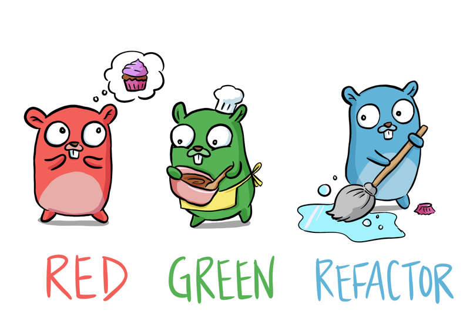

# Learn Go with Tests

  

[Art by Denise](https://twitter.com/deniseyu21)

## Formats

- [Gitbook](https://quii.gitbook.io/learn-go-with-tests)
- [EPUB or PDF](https://github.com/quii/learn-go-with-tests/releases)

## Translations

- [中文](https://studygolang.gitbook.io/learn-go-with-tests)
- [Português](https://larien.gitbook.io/aprenda-go-com-testes/)
- [日本語](https://andmorefine.gitbook.io/learn-go-with-tests/)

## Support me

I am proud to offer this resource for free, but if you wish to give some appreciation, [https://twitter.com/quii](Tweet me @quii) or:

- [Buy me a coffee :coffee:](https://www.buymeacoffee.com/quii) 
- [Sponsor me on GitHub](https://github.com/sponsors/quii)

## Why

* Explore the Go language by writing tests
* **Get a grounding with TDD**. Go is a good language for learning TDD because it is a simple language to learn and testing is built-in
* Be confident that you'll be able to start writing robust, well-tested systems in Go
* [Watch a video, or read about why unit testing and TDD is important](why.md)

## Table of contents

### Go fundamentals

1. [Install Go](install-go.md) - Set up environment for productivity.
2. [Hello, world](hello-world.md) - Declaring variables, constants, if/else statements, switch, write your first go program and write your first test. Sub-test syntax and closures.
3. [Integers](integers.md) - Further Explore function declaration syntax and learn new ways to improve the documentation of your code.
4. [Iteration](iteration.md) - Learn about `for` and benchmarking.
5. [Arrays and slices](arrays-and-slices.md) - Learn about arrays, slices, `len`, varargs, `range` and test coverage.
6. [Structs, methods & interfaces](structs-methods-and-interfaces.md) - Learn about `struct`, methods, `interface` and table driven tests.
7. [Pointers & errors](pointers-and-errors.md) - Learn about pointers and errors.
8. [Maps](maps.md) - Learn about storing values in the map data structure.
9. [Dependency Injection](dependency-injection.md) - Learn about dependency injection, how it relates to using interfaces and a primer on io.
10. [Mocking](mocking.md) - Take some existing untested code and use DI with mocking to test it.
11. [Concurrency](concurrency.md) - Learn how to write concurrent code to make your software faster.
12. [Select](select.md) - Learn how to synchronise asynchronous processes elegantly.
13. [Reflection](reflection.md) - Learn about reflection
13. [Sync](sync.md) - Learn some functionality from the sync package including `WaitGroup` and `Mutex`
13. [Context](context.md) - Use the context package to manage and cancel long-running processes
14. [Intro to property based tests](roman-numerals.md) - Practice some TDD with the Roman Numerals kata and get a brief intro to property based tests
15. [Maths](math.md) - Use the `math` package to draw an SVG clock

### Build an application

Now that you have hopefully digested the _Go Fundamentals_ section you have a solid grounding of a majority of Go's language features and how to do TDD.

This next section will involve building an application.

Each chapter will iterate on the previous one, expanding the application's functionality as our product owner dictates.

New concepts will be introduced to help facilitate writing great code but most of the new material will be learning what can be accomplished from Go's standard library.

By the end of this, you should have a strong grasp as to how to iteratively write an application in Go, backed by tests.

* [HTTP server](http-server.md) - We will create an application which listens to HTTP requests and responds to them.
* [JSON, routing and embedding](json.md) - We will make our endpoints return JSON and explore how to do routing.
* [IO and sorting](io.md) - We will persist and read our data from disk and we'll cover sorting data.
* [Command line & project structure](command-line.md) - Support multiple applications from one code base and read input from command line.
* [Time](time.md) - using the `time` package to schedule activities.
* [WebSockets](websockets.md) - learn how to write and test a server that uses WebSockets.

### Questions and answers

I often run in to questions on the internets like

> How do I test my amazing function that does x, y and z

If you have such a question raise it as an issue on github and I'll try and find time to write a short chapter to tackle the issue. I feel like content like this is valuable as it is tackling people's _real_ questions around testing.

* [OS exec](os-exec.md) - An example of how we can reach out to the OS to execute commands to fetch data and keep our business logic testable/
* [Error types](error-types.md) - Example of creating your own error types to improve your tests and make your code easier to work with.
* [Context-aware Reader](context-aware-reader.md) - Learn how to TDD augmenting `io.Reader` with cancellation. Based on [Context-aware io.Reader for Go](https://pace.dev/blog/2020/02/03/context-aware-ioreader-for-golang-by-mat-ryer)
* [Revisiting HTTP Handlers](http-handlers-revisited.md) - Testing HTTP handlers seems to be the bane of many a developer's existence. This chapter explores the issues around designing handlers correctly.

### Meta / Discussion

* [Why](why.md) - Watch a video, or read about why unit testing and TDD is important
* [Anti-patterns](anti-patterns.md) - A short chapter on TDD and unit testing anti-patterns

## Contributing

* _This project is work in progress_ If you would like to contribute, please do get in touch.
* Read [contributing.md](https://github.com/quii/learn-go-with-tests/tree/842f4f24d1f1c20ba3bb23cbc376c7ca6f7ca79a/contributing.md) for guidelines
* Any ideas? Create an issue

## Background

I have some experience introducing Go to development teams and have tried different approaches as to how to grow a team from some people curious about Go into highly effective writers of Go systems.

### What didn't work

#### Read _the_ book

An approach we tried was to take [the blue book](https://www.amazon.co.uk/Programming-Language-Addison-Wesley-Professional-Computing/dp/0134190440) and every week discuss the next chapter along with the exercises.

I love this book but it requires a high level of commitment. The book is very detailed in explaining concepts, which is obviously great but it means that the progress is slow and steady - this is not for everyone.

I found that whilst a small number of people would read chapter X and do the exercises, many people didn't.

#### Solve some problems

Katas are fun but they are usually limited in their scope for learning a language; you're unlikely to use goroutines to solve a kata.

Another problem is when you have varying levels of enthusiasm. Some people just learn way more of the language than others and when demonstrating what they have done end up confusing people with features the others are not familiar with.

This ends up making the learning feel quite _unstructured_ and _ad hoc_.

### What did work

By far the most effective way was by slowly introducing the fundamentals of the language by reading through [go by example](https://gobyexample.com/), exploring them with examples and discussing them as a group. This was a more interactive approach than "read chapter x for homework".

Over time the team gained a solid foundation of the _grammar_ of the language so we could then start to build systems.

This to me seems analogous to practicing scales when trying to learn guitar.

It doesn't matter how artistic you think you are, you are unlikely to write good music without understanding the fundamentals and practicing the mechanics.

### What works for me

When _I_ learn a new programming language I usually start by messing around in a REPL but eventually, I need more structure.

What I like to do is explore concepts and then solidify the ideas with tests. Tests verify the code I write is correct and documents the feature I have learned.

Taking my experience of learning with a group and my own personal way I am going to try and create something that hopefully proves useful to other teams. Learning the fundamentals by writing small tests so that you can then take your existing software design skills and ship some great systems.

## Who this is for

* People who are interested in picking up Go.
* People who already know some Go, but want to explore testing with TDD.

## What you'll need

* A computer!
* [Installed Go](https://golang.org/)
* A text editor
* Some experience with programming. Understanding of concepts like `if`, variables, functions etc.
* Comfortable with using the terminal

## Feedback

* Add issues/submit PRs [here](https://github.com/quii/learn-go-with-tests) or [tweet me @quii](https://twitter.com/quii)

[MIT license](LICENSE.md)

[Logo is by egonelbre](https://github.com/egonelbre) What a star!
