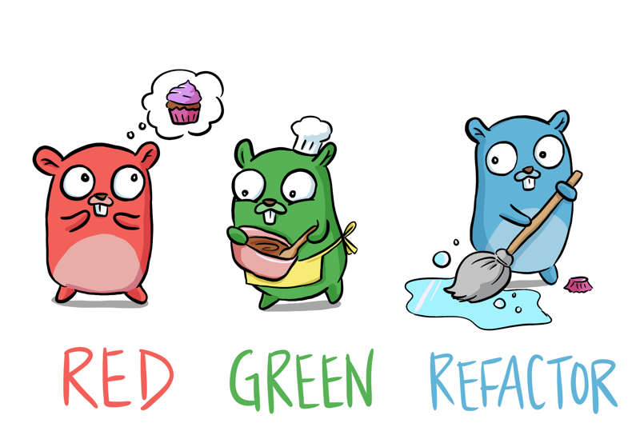

# テスト駆動開発でGO言語を学びましょう

[Art by Denise](https://twitter.com/deniseyu21)

Go言語でテスト駆動開発を学ぶ

翻訳:[英語](https://quii.gitbook.io/learn-go-with-tests/), [中文](https://studygolang.gitbook.io/learn-go-with-tests), [Português](https://larien.gitbook.io/aprenda-go-com-testes/)

* テストを作成してGo言語を探索する
* **テスト駆動開発\(TDD\)を使用しながらGoを習得します。**GoはTDDを学習するのに適した言語です。TDDは簡単に学習することができ、テストが組み込まれているからです。
* Goで堅牢な十分にテストされたシステムの作成を開始できることを確信してみてください。

## 背景

私は、Goを開発チームに導入し経験があり、Goに興味のある一部の人からGoシステムの非常に効果的な記述方法で、チームを成長させる方法について、さまざまなアプローチを試してみました。

### うまくいかなかったもの

#### 本を読む

私たちが試したアプローチとして、 [Go Programming Language](https://www.amazon.co.uk/Programming-Language-Addison-Wesley-Professional-Computing/dp/0134190440) という本を手に取り、毎週、次の章と演習について話し合うことでした。

私は、この本が大好きですが、それは高いレベルのコミットメントを必要としました。本は概念の説明をする上で非常に詳細であり、それは明らかに素晴らしいですが、進捗がゆっくりと着実であることを意味します。これはすべての人にあてはまるとは限りません。

少数の人が第X章を読んで、演習を行う一方で、多くの人は、読まなかったことがわかりました。

#### いくつかの問題を解決する

「型」は楽しいですが、通常、言語を学習する範囲は限られています。後ルーチンを使用して型を解決することはほとんどありません。

もう一つの問題は、さまざまなレベルの熱意がある場合です。一部の人々は他の人よりもはるかに多くの言語を学び、彼らが行ったことを実証するとき、他の人が慣れていない機能で人々を混乱させることになります。

これにより、学習はまったく構造化されておらず、その場しのぎの感じになります。

### 何がうまくいったか

群を抜いて最も効果的な方法は、 [go by example](https://gobyexample.com/) を読み、例を挙げて、それらを調査して、グループとして議論することで、言語の基礎をゆっくりと紹介することでした。これは「宿題については第X章を読む」よりもインタラクティブなアプローチでした。

時間の経過とともに、チームは言語の文法の強固な基盤を得て、システムの構築を開始できるようになりました。

私にとってこれは、ギターを習得しようとするときの感覚に似ています。

自分がどれほど芸術的であるかは関係ありません。基本を理解し、力学を練習しない限り、優れた音楽を書くことはほとんどありません。

### 自分にとって何がうまくいくか

新しいプログラミング言語を学ぶ際、私は、通常 `REPL` をいじり始めますが、最終的にはより多くの構造が必要になります。

私がやりたいのは、概念を探究し、テストでアイディアを固めることです。テストでは、作成したコードが正しいことを確認し、学習した機能を文書化します。

グループでの学習経験と自分の個人的な方法を取り入れて、他のチームに役立つと期待されるものを作成してみます。小規模なテストを記述して基礎を学び、既存のソフトウェア設定スキルを活用して優れたシステムを出荷できるようにします。

## 対象者

* Go言語に興味のある方
* すでに Go言語は知っているが、さらにテスト駆動開発\(TDD\)を試したい方

## 必要なもの

* コンピューター！
* [Go言語のインストール](https://golang.org/)
* テキストエディター
* プログラミングの経験。変数、関数などの概念の理解 `if`
* 端末の使用が快適

[MIT license](https://github.com/andmorefine/learn-go-with-tests/tree/2705e1505f1d4426969523d3c9be643bc40ca699/LICENSE.md)

