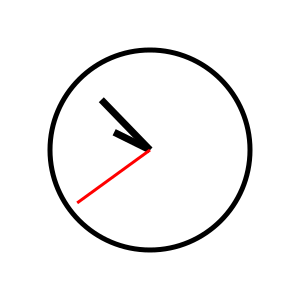
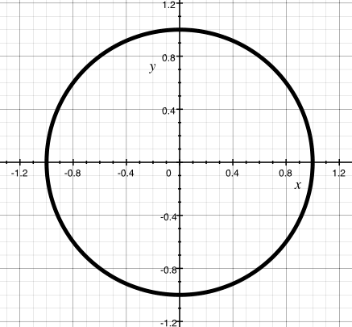
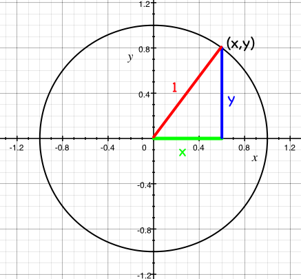
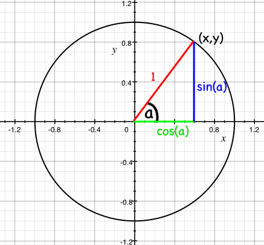
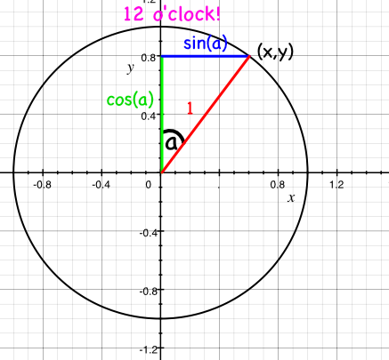
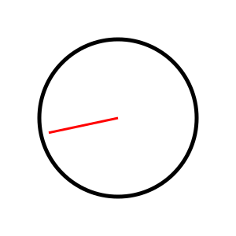
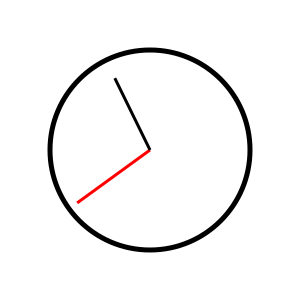
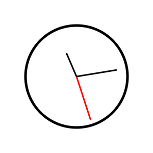

# Mathematics

**[You can find all the code for this chapter here](https://github.com/quii/learn-go-with-tests/tree/main/math)**

For all the power of modern computers to perform huge sums at
lightning speed, the average developer rarely uses any mathematics
to do their job. But not today! Today we'll use mathematics to
solve a _real_ problem. And not boring mathematics - we're going
to use trigonometry and vectors and all sorts of stuff that you
always said you'd never have to use after highschool.

## The Problem

You want to make an SVG of a clock. Not a digital clock - no, that
would be easy - an _analogue_ clock, with hands. You're not looking for anything
fancy, just a nice function that takes a `Time` from the `time` package and
spits out an SVG of a clock with all the hands - hour, minute and second -
pointing in the right direction. How hard can that be?

First we're going to need an SVG of a clock for us to play with. SVGs are a
fantastic image format to manipulate programmatically because they're written as
a series of shapes, described in XML. So this clock:



is described like this:

```xml
<?xml version="1.0" encoding="UTF-8" standalone="no"?>
<!DOCTYPE svg PUBLIC "-//W3C//DTD SVG 1.1//EN" "http://www.w3.org/Graphics/SVG/1.1/DTD/svg11.dtd">
<svg xmlns="http://www.w3.org/2000/svg"
     width="100%"
     height="100%"
     viewBox="0 0 300 300"
     version="2.0">

  <!-- bezel -->
  <circle cx="150" cy="150" r="100" style="fill:#fff;stroke:#000;stroke-width:5px;"/>

  <!-- hour hand -->
  <line x1="150" y1="150" x2="114.150000" y2="132.260000"
        style="fill:none;stroke:#000;stroke-width:7px;"/>

  <!-- minute hand -->
  <line x1="150" y1="150" x2="101.290000" y2="99.730000"
        style="fill:none;stroke:#000;stroke-width:7px;"/>

  <!-- second hand -->
  <line x1="150" y1="150" x2="77.190000" y2="202.900000"
        style="fill:none;stroke:#f00;stroke-width:3px;"/>
</svg>
```

It's a circle with three lines, each of the lines starting in the middle of the
circle (x=150, y=150), and ending some distance away.

So what we're going to do is reconstruct the above somehow, but change the lines
so they point in the appropriate directions for a given time.

## An Acceptance Test

Before we get too stuck in, lets think about an acceptance test.

Wait, you don't know what an acceptance test is yet. Look, let me try to
explain.

Let me ask you: what does winning look like? How do we know we've finished
work? TDD provides a good way of knowing when you've finished: when the test
passes. Sometimes it's nice - actually, almost all of the time it's nice -
to write a test that tells you when you've finished writing the whole usable
feature. Not just a test that tells you that a particular function is
working in the way you expect, but a test that tells you that the whole
thing you're trying to achieve - the 'feature' - is complete.

These tests are sometimes called 'acceptance tests', sometimes called
'feature test'. The idea is that you write a really high level test to
describe what you're trying to achieve - a user clicks a button on a website,
and they see a complete list of the Pokémon they've caught, for instance.
When we've written that test, we can then write more tests - unit tests -
that build towards a working system that will pass the acceptance test. So
for our example these tests might be about rendering a webpage with a button,
testing route handlers on a web server, performing database look ups, etc.
All of these things will be TDD'd, and all of them will go towards making
the original acceptance test pass.

Something like this _classic_ picture by Nat Pryce and Steve Freeman


Anyway, let's try and write that acceptance test - the one that will let us
know when we're done.

We've got an example clock, so let's think about what the important parameters are going to be.


```
<line x1="150" y1="150" x2="114.150000" y2="132.260000"
        style="fill:none;stroke:#000;stroke-width:7px;"/>
```

The centre of the clock (the attributes `x1` and `y1` for this line) is the same
for each hand of the clock. The numbers that need to change for each hand of the
clock - the parameters to whatever builds the SVG - are the `x2` and `y2`
attributes. We'll need an X and a Y for each of the hands of the clock.

I _could_ think about more parameters - the radius of the clockface circle, the
size of the SVG, the colours of the hands, their shape, etc... but it's better
to start off by solving a simple, concrete problem with a simple, concrete
solution, and then to start adding parameters to make it generalised.

So we'll say that
- every clock has a centre of (150, 150)
- the hour hand is 50 long
- the minute hand is 80 long
- the second hand is 90 long.

A thing to note about SVGs: the origin - point (0,0) - is at the _top left_ hand
corner, not the _bottom left_ as we might expect. It'll be important to remember
this when we're working out where what numbers to plug in to our lines.

Finally, I'm not deciding _how_ to construct the SVG - we could use a template
from the [`text/template`][texttemplate] package, or we could just send bytes into
a `bytes.Buffer` or a writer. But we know we'll need those numbers, so let's
focus on testing something that creates them.

### Write the test first

So my first test looks like this:

```go
package clockface_test

import (
	"testing"
	"time"

	"github.com/gypsydave5/learn-go-with-tests/math/v1/clockface"
)

func TestSecondHandAtMidnight(t *testing.T) {
	tm := time.Date(1337, time.January, 1, 0, 0, 0, 0, time.UTC)

	want := clockface.Point{X: 150, Y: 150 - 90}
	got := clockface.SecondHand(tm)

	if got != want {
		t.Errorf("Got %v, wanted %v", got, want)
	}
}
```

Remember how SVGs plot their coordinates from the top left hand corner? To place
the second hand at midnight we expect that it hasn't moved from the centre of
the clockface on the X axis - still 150 - and the Y axis is the length of the
hand 'up' from the centre; 150 minus 90.

### Try to run the test

This drives out the expected failures around the missing functions and types:

```
--- FAIL: TestSecondHandAtMidnight (0.00s)
./clockface_test.go:13:10: undefined: clockface.Point
./clockface_test.go:14:9: undefined: clockface.SecondHand
```

So a `Point` where the tip of the second hand should go, and a function to get it.

### Write the minimal amount of code for the test to run and check the failing test output

Let's implement those types to get the code to compile

```go
package clockface

import "time"

// A Point represents a two dimensional Cartesian coordinate
type Point struct {
	X float64
	Y float64
}

// SecondHand is the unit vector of the second hand of an analogue clock at time `t`
// represented as a Point.
func SecondHand(t time.Time) Point {
	return Point{}
}
```

and now we get:

```
--- FAIL: TestSecondHandAtMidnight (0.00s)
    clockface_test.go:17: Got {0 0}, wanted {150 60}
FAIL
exit status 1
FAIL	github.com/gypsydave5/learn-go-with-tests/math/v1/clockface	0.006s
```

### Write enough code to make it pass

When we get the expected failure, we can fill in the return value of `SecondHand`:

```go
// SecondHand is the unit vector of the second hand of an analogue clock at time `t`
// represented as a Point.
func SecondHand(t time.Time) Point {
	return Point{150, 60}
}
```

Behold, a passing test.

```
PASS
ok  	    clockface	0.006s
```

### Refactor

No need to refactor yet - there's barely enough code!

### Repeat for new requirements

We probably need to do some work here that doesn't just involve returning
a clock that shows midnight for every time...

### Write the test first

```go
func TestSecondHandAt30Seconds(t *testing.T) {
	tm := time.Date(1337, time.January, 1, 0, 0, 30, 0, time.UTC)

	want := clockface.Point{X: 150, Y: 150 + 90}
	got := clockface.SecondHand(tm)

	if got != want {
		t.Errorf("Got %v, wanted %v", got, want)
	}
}
```

Same idea, but now the second hand is pointing _downwards_ so we _add_ the
length to the Y axis.

This will compile... but how do we make it pass?

## Thinking time

How are we going to solve this problem?

Every minute the second hand goes through the same 60 states, pointing in 60
different directions. When it's 0 seconds it points to the top of the clockface,
when it's 30 seconds it points to the bottom of the clockface. Easy enough.

So if I wanted to think about in what direction the second hand was pointing at,
say, 37 seconds, I'd want the angle between 12 o'clock and 37/60ths around the
circle. In degrees this is `(360 / 60 ) * 37 = 222`, but it's easier just to
remember that it's `37/60` of a complete rotation.

But the angle is only half the story; we need to know the X and Y coordinate
that the tip of the second hand is pointing at. How can we work that out?

## Math

Imagine a circle with a radius of 1 drawn around the origin - the coordinate `0,
0`.



This is called the 'unit circle' because... well, the radius is 1 unit!

The circumference of the circle is made of points on the grid - more
coordinates. The x and y components of each of these coordinates form
a triangle, the hypotenuse of which is always 1 (i.e. the radius of the circle).



Now, trigonometry will let us work out the lengths of X and Y for each triangle
if we know the angle they make with the origin. The X coordinate will be cos(a),
and the Y coordinate will be sin(a), where a is the angle made between the line
and the (positive) x axis.



(If you don't believe this, [go and look at Wikipedia...][circle])

One final twist - because we want to measure the angle from 12 o'clock rather
than from the X axis (3 o'clock), we need to swap the axis around; now
x = sin(a) and y = cos(a).



So now we know how to get the angle of the second hand (1/60th of a circle for
each second) and the X and Y coordinates. We'll need functions for both `sin`
and `cos`.

## `math`

Happily the Go `math` package has both, with one small snag we'll need to get
our heads around; if we look at the description of [`math.Cos`][mathcos]:

> Cos returns the cosine of the radian argument x.

It wants the angle to be in radians. So what's a radian? Instead of defining the full turn of a circle to be made up of 360 degrees, we define a full turn as being 2π radians. There are good reasons to do this that we won't go in to.[^2]

Now that we've done some reading, some learning and some thinking, we can write
our next test.

### Write the test first

All this maths is hard and confusing. I'm not confident I understand what's
going on - so let's write a test! We don't need to solve the whole problem in
one go - let's start off with working out the correct angle, in radians, for the
second hand at a particular time.

I'm going to write these tests _within_ the `clockface` package; they may never
get exported, and they may get deleted (or moved) once I have a better grip on
what's going on.

I'm also going to _comment out_ the acceptance test that I was working on while
I'm working on these tests - I don't want to get distracted by that test while
I'm getting this one to pass.

```go
package clockface

import (
	"math"
	"testing"
	"time"
)

func TestSecondsInRadians(t *testing.T) {
	thirtySeconds := time.Date(312, time.October, 28, 0, 0, 30, 0, time.UTC)
	want := math.Pi
	got := secondsInRadians(thirtySeconds)

	if want != got {
		t.Fatalf("Wanted %v radians, but got %v", want, got)
	}
}
```

Here we're testing that 30 seconds past the minute should put the
second hand at halfway around the clock. And it's our first use of
the `math` package! If a full turn of a circle is 2π radians, we
know that halfway round should just be π radians. `math.Pi` provides
us with a value for π.

### Try to run the test

```
./clockface_test.go:12:9: undefined: secondsInRadians
```

### Write the minimal amount of code for the test to run and check the failing test output

```go
func secondsInRadians(t time.Time) float64 {
	return 0
}
```

```
clockface_test.go:15: Wanted 3.141592653589793 radians, but got 0
```

### Write enough code to make it pass

```go
func secondsInRadians(t time.Time) float64 {
	return math.Pi
}
```

```
PASS
ok  	clockface	0.011s
```

### Refactor

Nothing needs refactoring yet

### Repeat for new requirements

Now we can extend the test to cover a few more scenarios. I'm going to skip
forward a bit and show some already refactored test code - it should be clear
enough how I got where I want to.

```go
func TestSecondsInRadians(t *testing.T) {
	cases := []struct {
		time  time.Time
		angle float64
	}{
		{simpleTime(0, 0, 30), math.Pi},
		{simpleTime(0, 0, 0), 0},
		{simpleTime(0, 0, 45), (math.Pi / 2) * 3},
		{simpleTime(0, 0, 7), (math.Pi / 30) * 7},
	}

	for _, c := range cases {
		t.Run(testName(c.time), func(t *testing.T) {
			got := secondsInRadians(c.time)
			if got != c.angle {
				t.Fatalf("Wanted %v radians, but got %v", c.angle, got)
			}
		})
	}
}
```

I added a couple of helper functions to make writing this table based test
a little less tedious. `testName` converts a time into a digital watch
format (HH:MM:SS), and `simpleTime` constructs a `time.Time` using only the
parts we actually care about (again, hours, minutes and seconds).[^1] Here
they are:

```go
func simpleTime(hours, minutes, seconds int) time.Time {
	return time.Date(312, time.October, 28, hours, minutes, seconds, 0, time.UTC)
}

func testName(t time.Time) string {
	return t.Format("15:04:05")
}
```

These two functions should help make these tests (and future tests) a little
easier to write and maintain.

This gives us some nice test output:


```
clockface_test.go:24: Wanted 0 radians, but got 3.141592653589793

clockface_test.go:24: Wanted 4.71238898038469 radians, but got 3.141592653589793
```

Time to implement all of that maths stuff we were talking about above:

```go
func secondsInRadians(t time.Time) float64 {
	return float64(t.Second()) * (math.Pi / 30)
}
```

One second is (2π / 60) radians... cancel out the 2 and we get π/30 radians.
Multiply that by the number of seconds (as a `float64`) and we should now have
all the tests passing...


```
clockface_test.go:24: Wanted 3.141592653589793 radians, but got 3.1415926535897936
```

Wait, what?

### Floats are horrible

Floating point arithmetic is [notoriously inaccurate][floatingpoint]. Computers
can only really handle integers, and rational numbers to some extent. Decimal
numbers start to become inaccurate, especially when we factor them up and down
as we are in the `secondsInRadians` function. By dividing `math.Pi` by 30 and
then by multiplying it by 30 we've ended up with _a number that's no longer the
same as `math.Pi`_.

There are two ways around this:

1. Live with it
2. Refactor our function by refactoring our equation

Now (1) may not seem all that appealing, but it's often the only way to make
floating point equality work. Being inaccurate by some infinitesimal fraction
is frankly not going to matter for the purposes of drawing a clockface, so we
could write a function that defines a 'close enough' equality for our angles.
But there's a simple way we can get the accuracy back: we rearrange the equation
so that we're no longer dividing down and then multiplying up. We can do it all
by just dividing.

So instead of

	numberOfSeconds * π / 30

we can write

	π / (30 / numberOfSeconds)

which is equivalent.

In Go:

```go
func secondsInRadians(t time.Time) float64 {
	return (math.Pi / (30 / (float64(t.Second()))))
}
```

And we get a pass.

```
PASS
ok      clockface     0.005s
```

It should all look [something like this](https://github.com/quii/learn-go-with-tests/tree/main/math/v3/clockface).

### A note on dividing by zero

Computers often don't like dividing by zero because infinity is a bit strange.

In Go if you try to explicitly divide by zero you will get a compilation error.

```go
package main

import (
	"fmt"
)

func main() {
	fmt.Println(10.0 / 0.0) // fails to compile
}
```

Obviously the compiler can't always predict that you'll divide by zero, such as our `t.Second()`

Try this

```go
func main() {
	fmt.Println(10.0 / zero())
}

func zero() float64 {
	return 0.0
}
```

It will print `+Inf` (infinity). Dividing by +Inf seems to result in zero and we can see this with the following:

```go
package main

import (
	"fmt"
	"math"
)

func main() {
	fmt.Println(secondsinradians())
}

func zero() float64 {
	return 0.0
}

func secondsinradians() float64 {
	return (math.Pi / (30 / (float64(zero()))))
}
```

### Repeat for new requirements

So we've got the first part covered here - we know what angle the second hand
will be pointing at in radians. Now we need to work out the coordinates.

Again, let's keep this as simple as possible and only work with the _unit
circle_; the circle with a radius of 1. This means that our hands will all have
a length of one but, on the bright side, it means that the maths will be easy
for us to swallow.

### Write the test first

```go
func TestSecondHandVector(t *testing.T) {
	cases := []struct {
		time  time.Time
		point Point
	}{
		{simpleTime(0, 0, 30), Point{0, -1}},
	}

	for _, c := range cases {
		t.Run(testName(c.time), func(t *testing.T) {
			got := secondHandPoint(c.time)
			if got != c.point {
				t.Fatalf("Wanted %v Point, but got %v", c.point, got)
			}
		})
	}
}
```

### Try to run the test

```
./clockface_test.go:40:11: undefined: secondHandPoint
```

### Write the minimal amount of code for the test to run and check the failing test output

```go
func secondHandPoint(t time.Time) Point {
	return Point{}
}
```

```
clockface_test.go:42: Wanted {0 -1} Point, but got {0 0}
```

### Write enough code to make it pass

```go
func secondHandPoint(t time.Time) Point {
	return Point{0, -1}
}
```

```
PASS
ok  	clockface	0.007s
```

### Repeat for new requirements

```go
func TestSecondHandPoint(t *testing.T) {
	cases := []struct {
		time  time.Time
		point Point
	}{
		{simpleTime(0, 0, 30), Point{0, -1}},
		{simpleTime(0, 0, 45), Point{-1, 0}},
	}

	for _, c := range cases {
		t.Run(testName(c.time), func(t *testing.T) {
			got := secondHandPoint(c.time)
			if got != c.point {
				t.Fatalf("Wanted %v Point, but got %v", c.point, got)
			}
		})
	}
}
```

### Try to run the test

```
clockface_test.go:43: Wanted {-1 0} Point, but got {0 -1}
```

### Write enough code to make it pass

Remember our unit circle picture?


Also recall that we want to measure the angle from 12 o'clock which is the Y axis instead of from the X axis which we would like measuring the angle between the second hand and 3 o'clock.


We now want the equation that produces X and Y. Let's write it into seconds:

```go
func secondHandPoint(t time.Time) Point {
	angle := secondsInRadians(t)
	x := math.Sin(angle)
	y := math.Cos(angle)

	return Point{x, y}
}
```
Now we get


```
clockface_test.go:43: Wanted {0 -1} Point, but got {1.2246467991473515e-16 -1}

clockface_test.go:43: Wanted {-1 0} Point, but got {-1 -1.8369701987210272e-16}
```

Wait, what (again)? Looks like we've been cursed by the floats once more - both
of those unexpected numbers are _infinitesimal_ - way down at the 16th decimal
place. So again we can either choose to try to increase precision, or to just
say that they're roughly equal and get on with our lives.

One option to increase the accuracy of these angles would be to use the rational
type `Rat` from the `math/big` package. But given the objective is to draw an
SVG and not land on the moon landings I think we can live with a bit of
fuzziness.

```go
func TestSecondHandPoint(t *testing.T) {
	cases := []struct {
		time  time.Time
		point Point
	}{
		{simpleTime(0, 0, 30), Point{0, -1}},
		{simpleTime(0, 0, 45), Point{-1, 0}},
	}

	for _, c := range cases {
		t.Run(testName(c.time), func(t *testing.T) {
			got := secondHandPoint(c.time)
			if !roughlyEqualPoint(got, c.point) {
				t.Fatalf("Wanted %v Point, but got %v", c.point, got)
			}
		})
	}
}

func roughlyEqualFloat64(a, b float64) bool {
	const equalityThreshold = 1e-7
	return math.Abs(a-b) < equalityThreshold
}

func roughlyEqualPoint(a, b Point) bool {
	return roughlyEqualFloat64(a.X, b.X) &&
		roughlyEqualFloat64(a.Y, b.Y)
}
```

We've defined two functions to define approximate equality between two
`Points` - they'll work if the X and Y elements are within 0.0000001 of each
other.  That's still pretty accurate.

And now we get:

```
PASS
ok  	clockface	0.007s
```

### Refactor

I'm still pretty happy with this.


Here's [what it looks like now](https://github.com/quii/learn-go-with-tests/tree/main/math/v4/clockface)

<!---
v4 ends
-->

### Repeat for new requirements

Well, saying _new_ isn't entirely accurate - really what we can do now is get
that acceptance test passing! Let's remind ourselves of what it looks like:


```go
func TestSecondHandAt30Seconds(t *testing.T) {
	tm := time.Date(1337, time.January, 1, 0, 0, 30, 0, time.UTC)

	want := clockface.Point{X: 150, Y: 150 + 90}
	got := clockface.SecondHand(tm)

	if got != want {
		t.Errorf("Got %v, wanted %v", got, want)
	}
}
```

### Try to run the test


```
clockface_acceptance_test.go:28: Got {150 60}, wanted {150 240}
```

### Write enough code to make it pass

We need to do three things to convert our unit vector into a point on the SVG:

1. Scale it to the length of the hand
2. Flip it over the X axis because to account for the SVG having an origin in
   the top left hand corner
3. Translate it to the right position (so that it's coming from an origin of
   (150,150))

Fun times!

```go
// SecondHand is the unit vector of the second hand of an analogue clock at time `t`
// represented as a Point.
func SecondHand(t time.Time) Point {
	p := secondHandPoint(t)
	p = Point{p.X * 90, p.Y * 90}   // scale
	p = Point{p.X, -p.Y}            // flip
	p = Point{p.X + 150, p.Y + 150} // translate
	return p
}
```

Scale, flip, and translate in exactly that order. Hooray maths!

```
PASS
ok  	clockface	0.007s
```

### Refactor

There's a few magic numbers here that should get pulled out as constants, so
let's do that

```go
const secondHandLength = 90
const clockCentreX = 150
const clockCentreY = 150

// SecondHand is the unit vector of the second hand of an analogue clock at time `t`
// represented as a Point.
func SecondHand(t time.Time) Point {
	p := secondHandPoint(t)
	p = Point{p.X * secondHandLength, p.Y * secondHandLength}
	p = Point{p.X, -p.Y}
	p = Point{p.X + clockCentreX, p.Y + clockCentreY} //translate
	return p
}
```

## Draw the clock

Well... the second hand anyway...

Let's do this thing - because there's nothing worse than not delivering some
value when it's just sitting there waiting to get out into the world to dazzle
people. Let's draw a second hand!

We're going to stick a new directory under our main `clockface` package
directory, called (confusingly), `clockface`. In there we'll put the `main`
package that will create the binary that will build an SVG:

```
|-- clockface
|       |-- main.go
|-- clockface.go
|-- clockface_acceptance_test.go
|-- clockface_test.go
```

Inside `main.go`, you'll start with this code but change the import for the
clockface package to point at your own version:

```go
package main

import (
	"fmt"
	"io"
	"os"
	"time"

	"github.com/quii/learn-go-with-tests/math/clockface" // REPLACE THIS!
)

func main() {
	t := time.Now()
	sh := clockface.SecondHand(t)
	io.WriteString(os.Stdout, svgStart)
	io.WriteString(os.Stdout, bezel)
	io.WriteString(os.Stdout, secondHandTag(sh))
	io.WriteString(os.Stdout, svgEnd)
}

func secondHandTag(p clockface.Point) string {
	return fmt.Sprintf(`<line x1="150" y1="150" x2="%f" y2="%f" style="fill:none;stroke:#f00;stroke-width:3px;"/>`, p.X, p.Y)
}

const svgStart = `<?xml version="1.0" encoding="UTF-8" standalone="no"?>
<!DOCTYPE svg PUBLIC "-//W3C//DTD SVG 1.1//EN" "http://www.w3.org/Graphics/SVG/1.1/DTD/svg11.dtd">
<svg xmlns="http://www.w3.org/2000/svg"
     width="100%"
     height="100%"
     viewBox="0 0 300 300"
     version="2.0">`

const bezel = `<circle cx="150" cy="150" r="100" style="fill:#fff;stroke:#000;stroke-width:5px;"/>`

const svgEnd = `</svg>`
```

Oh boy am I not trying to win any prizes for beautiful code with _this_ mess -
but it does the job. It's writing an SVG out to `os.Stdout` - one string at
a time.

If we build this

```
go build
```

and run it, sending the output into a file

```
./clockface > clock.svg
```

We should see something like



And this is [how the code looks](https://github.com/quii/learn-go-with-tests/tree/main/math/v6/clockface).

<!--
Here ends v6
-->


### Refactor

This stinks. Well, it doesn't quite _stink_ stink, but I'm not happy about it.

1. That whole `SecondHand` function is _super_ tied to being an SVG... without
   mentioning SVGs or actually producing an SVG...
2. ... while at the same time I'm not testing any of my SVG code.

Yeah, I guess I screwed up. This feels wrong. Let's try to recover with a more
SVG-centric test.

What are our options? Well, we could try testing that the characters spewing out
of the `SVGWriter` contain things that look like the sort of SVG tag we're
expecting for a particular time. For instance:

```go
func TestSVGWriterAtMidnight(t *testing.T) {
	tm := time.Date(1337, time.January, 1, 0, 0, 0, 0, time.UTC)

	var b strings.Builder
	clockface.SVGWriter(&b, tm)
	got := b.String()

	want := `<line x1="150" y1="150" x2="150" y2="60"`

	if !strings.Contains(got, want) {
		t.Errorf("Expected to find the second hand %v, in the SVG output %v", want, got)
	}
}
```

But is this really an improvement?

Not only will it still pass if I don't produce a valid SVG (as it's only testing
that a string appears in the output), but it will also fail if I make the
smallest, unimportant change to that string - if I add an extra space between
the attributes, for instance.

The _biggest_ smell is that I'm testing a data structure - XML - by looking
at its representation as a series of characters - as a string. This is _never_,
_ever_ a good idea as it produces problems just like the ones I outline above:
a test that's both too fragile and not sensitive enough. A test that's testing
the wrong thing!

So the only solution is to test the output _as XML_. And to do that we'll need
to parse it.

## Parsing XML

[`encoding/xml`][xml] is the Go package that can handle all things to do with
simple XML parsing.


The function [`xml.Unmarshal`](https://pkg.go.dev/encoding/xml#Unmarshal) takes
a `[]byte` of XML data, and a pointer to a struct for it to get unmarshalled in
to.

So we'll need a struct to unmarshall our XML into. We could spend some time
working out what the correct names for all of the nodes and attributes, and how
to write the correct structure but, happily, someone has written
[`zek`](https://github.com/miku/zek) a program that will automate all of that
hard work for us.  Even better, there's an online version at
https://www.onlinetool.io/xmltogo/. Just
paste the SVG from the top of the file into one box and - bam - out pops:

```go
type Svg struct {
	XMLName xml.Name `xml:"svg"`
	Text    string   `xml:",chardata"`
	Xmlns   string   `xml:"xmlns,attr"`
	Width   string   `xml:"width,attr"`
	Height  string   `xml:"height,attr"`
	ViewBox string   `xml:"viewBox,attr"`
	Version string   `xml:"version,attr"`
	Circle  struct {
		Text  string `xml:",chardata"`
		Cx    string `xml:"cx,attr"`
		Cy    string `xml:"cy,attr"`
		R     string `xml:"r,attr"`
		Style string `xml:"style,attr"`
	} `xml:"circle"`
	Line []struct {
		Text  string `xml:",chardata"`
		X1    string `xml:"x1,attr"`
		Y1    string `xml:"y1,attr"`
		X2    string `xml:"x2,attr"`
		Y2    string `xml:"y2,attr"`
		Style string `xml:"style,attr"`
	} `xml:"line"`
}
```

We could make adjustments to this if we needed to (like changing the name of the
struct to `SVG`) but it's definitely good enough to start us off. Paste the
struct into the `clockface_test` file and let's write a test with it:

```go
func TestSVGWriterAtMidnight(t *testing.T) {
	tm := time.Date(1337, time.January, 1, 0, 0, 0, 0, time.UTC)

	b := bytes.Buffer{}
	clockface.SVGWriter(&b, tm)

	svg := Svg{}
	xml.Unmarshal(b.Bytes(), &svg)

	x2 := "150"
	y2 := "60"

	for _, line := range svg.Line {
		if line.X2 == x2 && line.Y2 == y2 {
			return
		}
	}

	t.Errorf("Expected to find the second hand with x2 of %+v and y2 of %+v, in the SVG output %v", x2, y2, b.String())
}
```

We write the output of `clockface.SVGWriter` to a `bytes.Buffer`
and then `Unmarshal` it into an `Svg`. We then look at each `Line` in the `Svg`
to see if any of them have the expected `X2` and `Y2` values. If we get a match
we return early (passing the test); if not we fail with a (hopefully)
informative message.


```sh
./clockface_acceptance_test.go:41:2: undefined: clockface.SVGWriter
```

Looks like we'd better write that `SVGWriter`...

```go
package clockface

import (
	"fmt"
	"io"
	"time"
)

const (
	secondHandLength = 90
	clockCentreX     = 150
	clockCentreY     = 150
)

//SVGWriter writes an SVG representation of an analogue clock, showing the time t, to the writer w
func SVGWriter(w io.Writer, t time.Time) {
	io.WriteString(w, svgStart)
	io.WriteString(w, bezel)
	secondHand(w, t)
	io.WriteString(w, svgEnd)
}

func secondHand(w io.Writer, t time.Time) {
	p := secondHandPoint(t)
	p = Point{p.X * secondHandLength, p.Y * secondHandLength} // scale
	p = Point{p.X, -p.Y}                                      // flip
	p = Point{p.X + clockCentreX, p.Y + clockCentreY}         // translate
	fmt.Fprintf(w, `<line x1="150" y1="150" x2="%f" y2="%f" style="fill:none;stroke:#f00;stroke-width:3px;"/>`, p.X, p.Y)
}

const svgStart = `<?xml version="1.0" encoding="UTF-8" standalone="no"?>
<!DOCTYPE svg PUBLIC "-//W3C//DTD SVG 1.1//EN" "http://www.w3.org/Graphics/SVG/1.1/DTD/svg11.dtd">
<svg xmlns="http://www.w3.org/2000/svg"
     width="100%"
     height="100%"
     viewBox="0 0 300 300"
     version="2.0">`

const bezel = `<circle cx="150" cy="150" r="100" style="fill:#fff;stroke:#000;stroke-width:5px;"/>`

const svgEnd = `</svg>`
```

The most beautiful SVG writer? No. But hopefully it'll do the job...

```
clockface_acceptance_test.go:56: Expected to find the second hand with x2 of 150 and y2 of 60, in the SVG output <?xml version="1.0" encoding="UTF-8" standalone="no"?>
    <!DOCTYPE svg PUBLIC "-//W3C//DTD SVG 1.1//EN" "http://www.w3.org/Graphics/SVG/1.1/DTD/svg11.dtd">
    <svg xmlns="http://www.w3.org/2000/svg"
         width="100%"
         height="100%"
         viewBox="0 0 300 300"
         version="2.0"><circle cx="150" cy="150" r="100" style="fill:#fff;stroke:#000;stroke-width:5px;"/><line x1="150" y1="150" x2="150.000000" y2="60.000000" style="fill:none;stroke:#f00;stroke-width:3px;"/></svg>
```

Oooops! The `%f` format directive is printing our coordinates to the default
level of precision - six decimal places. We should be explicit as to what level
of precision we're expecting for the coordinates. Let's say three decimal
places.

```go
	fmt.Fprintf(w, `<line x1="150" y1="150" x2="%.3f" y2="%.3f" style="fill:none;stroke:#f00;stroke-width:3px;"/>`, p.X, p.Y)
```

And after we update our expectations in the test

```go
	x2 := "150.000"
	y2 := "60.000"
```

We get:

```
PASS
ok  	clockface	0.006s
```

We can now shorten our `main` function:

```go
package main

import (
	"os"
	"time"

	"github.com/gypsydave5/learn-go-with-tests/math/v7b/clockface"
)

func main() {
	t := time.Now()
	clockface.SVGWriter(os.Stdout, t)
}
```

This is what [things should look like now](https://github.com/quii/learn-go-with-tests/blob/main/math/v7b/clockface).

And we can write a test for another time following the same pattern, but not
before...

<!--
Here ends 7b
-->

### Refactor

Three things stick out:

1. We're not really testing for all of the information we need to ensure is
   present - what about the `x1` values, for instance?
2. Also, those attributes for `x1` etc. aren't really `strings` are they? They're
   numbers!
3. Do I really care about the `style` of the hand? Or, for that matter, the
   empty `Text` node that's been generated by `zak`?

We can do better. Let's make a few adjustments to the `Svg` struct, and the
tests, to sharpen everything up.

```go
type SVG struct {
	XMLName xml.Name `xml:"svg"`
	Xmlns   string   `xml:"xmlns,attr"`
	Width   string   `xml:"width,attr"`
	Height  string   `xml:"height,attr"`
	ViewBox string   `xml:"viewBox,attr"`
	Version string   `xml:"version,attr"`
	Circle  Circle   `xml:"circle"`
	Line    []Line   `xml:"line"`
}

type Circle struct {
	Cx float64 `xml:"cx,attr"`
	Cy float64 `xml:"cy,attr"`
	R  float64 `xml:"r,attr"`
}

type Line struct {
	X1 float64 `xml:"x1,attr"`
	Y1 float64 `xml:"y1,attr"`
	X2 float64 `xml:"x2,attr"`
	Y2 float64 `xml:"y2,attr"`
}
```

Here I've

- Made the important parts of the struct named types -- the `Line` and the
  `Circle`
- Turned the numeric attributes into `float64`s instead of `string`s.
- Deleted unused attributes like `Style` and `Text`
- Renamed `Svg` to `SVG` because _it's the right thing to do_.

This will let us assert more precisely on the line we're looking for:

```go
func TestSVGWriterAtMidnight(t *testing.T) {
	tm := time.Date(1337, time.January, 1, 0, 0, 0, 0, time.UTC)
	b := bytes.Buffer{}

	clockface.SVGWriter(&b, tm)

	svg := SVG{}

	xml.Unmarshal(b.Bytes(), &svg)

	want := Line{150, 150, 150, 60}

	for _, line := range svg.Line {
		if line == want {
			return
		}
	}

	t.Errorf("Expected to find the second hand line %+v, in the SVG lines %+v", want, svg.Line)
}
```

Finally we can take a leaf out of the unit tests' tables, and we can write
a helper function `containsLine(line Line, lines []Line) bool` to really make
these tests shine:

```go
func TestSVGWriterSecondHand(t *testing.T) {
	cases := []struct {
		time time.Time
		line Line
	}{
		{
			simpleTime(0, 0, 0),
			Line{150, 150, 150, 60},
		},
		{
			simpleTime(0, 0, 30),
			Line{150, 150, 150, 240},
		},
	}

	for _, c := range cases {
		t.Run(testName(c.time), func(t *testing.T) {
			b := bytes.Buffer{}
			clockface.SVGWriter(&b, c.time)

			svg := SVG{}
			xml.Unmarshal(b.Bytes(), &svg)

			if !containsLine(c.line, svg.Line) {
				t.Errorf("Expected to find the second hand line %+v, in the SVG lines %+v", c.line, svg.Line)
			}
		})
	}
}

func containsLine(l Line, ls []Line) bool {
	for _, line := range ls {
		if line == l {
			return true
		}
	}
	return false
}
```

Here's what [it looks like](https://github.com/quii/learn-go-with-tests/blob/main/math/v7c/clockface)

Now _that's_ what I call an acceptance test!

<!--
Here ends v7c
-->

### Write the test first

So that's the second hand done. Now let's get started on the minute hand.

```go
func TestSVGWriterMinuteHand(t *testing.T) {
	cases := []struct {
		time time.Time
		line Line
	}{
		{
			simpleTime(0, 0, 0),
			Line{150, 150, 150, 70},
		},
	}

	for _, c := range cases {
		t.Run(testName(c.time), func(t *testing.T) {
			b := bytes.Buffer{}
			clockface.SVGWriter(&b, c.time)

			svg := SVG{}
			xml.Unmarshal(b.Bytes(), &svg)

			if !containsLine(c.line, svg.Line) {
				t.Errorf("Expected to find the minute hand line %+v, in the SVG lines %+v", c.line, svg.Line)
			}
		})
	}
}
```

### Try to run the test

```
clockface_acceptance_test.go:87: Expected to find the minute hand line {X1:150 Y1:150 X2:150 Y2:70}, in the SVG lines [{X1:150 Y1:150 X2:150 Y2:60}]
```

We'd better start building some other clock hands, Much in the same way as we
produced the tests for the second hand, we can iterate to produce the following
set of tests. Again we'll comment out our acceptance test while we get this
working:

```go
func TestMinutesInRadians(t *testing.T) {
	cases := []struct {
		time  time.Time
		angle float64
	}{
		{simpleTime(0, 30, 0), math.Pi},
	}

	for _, c := range cases {
		t.Run(testName(c.time), func(t *testing.T) {
			got := minutesInRadians(c.time)
			if got != c.angle {
				t.Fatalf("Wanted %v radians, but got %v", c.angle, got)
			}
		})
	}
}
```

### Try to run the test

```
./clockface_test.go:59:11: undefined: minutesInRadians
```

### Write the minimal amount of code for the test to run and check the failing test output

```go
func minutesInRadians(t time.Time) float64 {
	return math.Pi
}
```

### Repeat for new requirements

Well, OK - now let's make ourselves do some _real_ work. We could model the
minute hand as only moving every full minute - so that it 'jumps' from 30 to 31
minutes past without moving in between. But that would look a bit rubbish. What
we want it to do is move a _tiny little bit_ every second.

```go
func TestMinutesInRadians(t *testing.T) {
	cases := []struct {
		time  time.Time
		angle float64
	}{
		{simpleTime(0, 30, 0), math.Pi},
		{simpleTime(0, 0, 7), 7 * (math.Pi / (30 * 60))},
	}

	for _, c := range cases {
		t.Run(testName(c.time), func(t *testing.T) {
			got := minutesInRadians(c.time)
			if got != c.angle {
				t.Fatalf("Wanted %v radians, but got %v", c.angle, got)
			}
		})
	}
}
```

How much is that tiny little bit? Well...

- Sixty seconds in a minute
- thirty minutes in a half turn of the circle (`math.Pi` radians)
- so `30 * 60` seconds in a half turn.
- So if the time is 7 seconds past the hour ...
- ... we're expecting to see the minute hand at `7 * (math.Pi / (30 * 60))`
  radians past the 12.

### Try to run the test

```
clockface_test.go:62: Wanted 0.012217304763960306 radians, but got 3.141592653589793
```

### Write enough code to make it pass

In the immortal words of Jennifer Aniston: [Here comes the science bit](https://www.youtube.com/watch?v=29Im23SPNok)

```go
func minutesInRadians(t time.Time) float64 {
	return (secondsInRadians(t) / 60) +
		(math.Pi / (30 / float64(t.Minute())))
}
```

Rather than working out how far to push the minute hand around the clockface for
every second from scratch, here we can just leverage the `secondsInRadians`
function. For every second the minute hand will move 1/60th of the angle the
second hand moves.

```go
secondsInRadians(t) / 60
```

Then we just add on the movement for the minutes - similar to the movement of
the second hand.

```go
math.Pi / (30 / float64(t.Minute()))
```

And...

```
PASS
ok  	clockface	0.007s
```

Nice and easy. This is what things [look like now](https://github.com/quii/learn-go-with-tests/blob/main/math/v8/clockface/clockface_acceptance_test.go)

### Repeat for new requirements

Should I add more cases to the `minutesInRadians` test? At the moment there are
only two. How many cases do I need before I move on to the testing the
`minuteHandPoint` function?

One of my favourite TDD quotes, often attributed to Kent Beck,[^3] is

> Write tests until fear is transformed into boredom.

And, frankly, I'm bored of testing that function. I'm confident I know how it
works. So it's on to the next one.


<!--
here ends v8
-->

### Write the test first

```go
func TestMinuteHandPoint(t *testing.T) {
	cases := []struct {
		time  time.Time
		point Point
	}{
		{simpleTime(0, 30, 0), Point{0, -1}},
	}

	for _, c := range cases {
		t.Run(testName(c.time), func(t *testing.T) {
			got := minuteHandPoint(c.time)
			if !roughlyEqualPoint(got, c.point) {
				t.Fatalf("Wanted %v Point, but got %v", c.point, got)
			}
		})
	}
}
```

### Try to run the test

```
./clockface_test.go:79:11: undefined: minuteHandPoint
```

### Write the minimal amount of code for the test to run and check the failing test output

```go
func minuteHandPoint(t time.Time) Point {
	return Point{}
}
```

```
clockface_test.go:80: Wanted {0 -1} Point, but got {0 0}
```

### Write enough code to make it pass

```go
func minuteHandPoint(t time.Time) Point {
	return Point{0, -1}
}
```

```
PASS
ok  	clockface	0.007s
```

### Repeat for new requirements

And now for some actual work

```go
func TestMinuteHandPoint(t *testing.T) {
	cases := []struct {
		time  time.Time
		point Point
	}{
		{simpleTime(0, 30, 0), Point{0, -1}},
		{simpleTime(0, 45, 0), Point{-1, 0}},
	}

	for _, c := range cases {
		t.Run(testName(c.time), func(t *testing.T) {
			got := minuteHandPoint(c.time)
			if !roughlyEqualPoint(got, c.point) {
				t.Fatalf("Wanted %v Point, but got %v", c.point, got)
			}
		})
	}
}
```

```
clockface_test.go:81: Wanted {-1 0} Point, but got {0 -1}
```

### Write enough code to make it pass

A quick copy and paste of the `secondHandPoint` function with some minor changes
ought to do it...

```go
func minuteHandPoint(t time.Time) Point {
	angle := minutesInRadians(t)
	x := math.Sin(angle)
	y := math.Cos(angle)

	return Point{x, y}
}
```

```
PASS
ok  	clockface	0.009s
```

### Refactor

We've definitely got a bit of repetition in the `minuteHandPoint` and
`secondHandPoint` - I know because we just copied and pasted one to make the
other. Let's DRY it out with a function.

```go
func angleToPoint(angle float64) Point {
	x := math.Sin(angle)
	y := math.Cos(angle)

	return Point{x, y}
}
```

and we can rewrite `minuteHandPoint` and `secondHandPoint` as one liners:

```go
func minuteHandPoint(t time.Time) Point {
	return angleToPoint(minutesInRadians(t))
}
```

```go
func secondHandPoint(t time.Time) Point {
	return angleToPoint(secondsInRadians(t))
}
```

```
PASS
ok  	clockface	0.007s
```

Now we can uncomment the acceptance test and get to work drawing the minute
hand.

### Write enough code to make it pass

The `minuteHand` function is a copy-and-paste of `secondHand` with some
minor adjustments, such as declaring a `minuteHandLength`:

```go
const minuteHandLength = 80

//...

func minuteHand(w io.Writer, t time.Time) {
	p := minuteHandPoint(t)
	p = Point{p.X * minuteHandLength, p.Y * minuteHandLength}
	p = Point{p.X, -p.Y}
	p = Point{p.X + clockCentreX, p.Y + clockCentreY}
	fmt.Fprintf(w, `<line x1="150" y1="150" x2="%.3f" y2="%.3f" style="fill:none;stroke:#000;stroke-width:3px;"/>`, p.X, p.Y)
}
```

And a call to it in our `SVGWriter` function:

```go
func SVGWriter(w io.Writer, t time.Time) {
	io.WriteString(w, svgStart)
	io.WriteString(w, bezel)
	secondHand(w, t)
	minuteHand(w, t)
	io.WriteString(w, svgEnd)
}
```

Now we should see that `TestSVGWriterMinuteHand` passes:

```
PASS
ok  	clockface	0.006s
```

But the proof of the pudding is in the eating - if we now compile and run our
`clockface` program, we should see something like



### Refactor

Let's remove the duplication from the `secondHand` and `minuteHand` functions,
putting all of that scale, flip and translate logic all in one place.

```go
func secondHand(w io.Writer, t time.Time) {
	p := makeHand(secondHandPoint(t), secondHandLength)
	fmt.Fprintf(w, `<line x1="150" y1="150" x2="%.3f" y2="%.3f" style="fill:none;stroke:#f00;stroke-width:3px;"/>`, p.X, p.Y)
}

func minuteHand(w io.Writer, t time.Time) {
	p := makeHand(minuteHandPoint(t), minuteHandLength)
	fmt.Fprintf(w, `<line x1="150" y1="150" x2="%.3f" y2="%.3f" style="fill:none;stroke:#000;stroke-width:3px;"/>`, p.X, p.Y)
}

func makeHand(p Point, length float64) Point {
	p = Point{p.X * length, p.Y * length}
	p = Point{p.X, -p.Y}
	return Point{p.X + clockCentreX, p.Y + clockCentreY}
}
```

```
PASS
ok  	clockface	0.007s
```

This is [where we're up to now](https://github.com/quii/learn-go-with-tests/tree/main/math/v9/clockface).

There... now it's just the hour hand to do!

<!--
v9 ends here
-->

### Write the test first

```go
func TestSVGWriterHourHand(t *testing.T) {
	cases := []struct {
		time time.Time
		line Line
	}{
		{
			simpleTime(6, 0, 0),
			Line{150, 150, 150, 200},
		},
	}

	for _, c := range cases {
		t.Run(testName(c.time), func(t *testing.T) {
			b := bytes.Buffer{}
			clockface.SVGWriter(&b, c.time)

			svg := SVG{}
			xml.Unmarshal(b.Bytes(), &svg)

			if !containsLine(c.line, svg.Line) {
				t.Errorf("Expected to find the hour hand line %+v, in the SVG lines %+v", c.line, svg.Line)
			}
		})
	}
}
```

### Try to run the test

```
clockface_acceptance_test.go:113: Expected to find the hour hand line {X1:150 Y1:150 X2:150 Y2:200}, in the SVG lines [{X1:150 Y1:150 X2:150 Y2:60} {X1:150 Y1:150 X2:150 Y2:70}]
```

Again, let's comment this one out until we've got the some coverage with the
lower level tests:

### Write the test first

```go
func TestHoursInRadians(t *testing.T) {
	cases := []struct {
		time  time.Time
		angle float64
	}{
		{simpleTime(6, 0, 0), math.Pi},
	}

	for _, c := range cases {
		t.Run(testName(c.time), func(t *testing.T) {
			got := hoursInRadians(c.time)
			if got != c.angle {
				t.Fatalf("Wanted %v radians, but got %v", c.angle, got)
			}
		})
	}
}
```

### Try to run the test

```
./clockface_test.go:97:11: undefined: hoursInRadians
```

### Write the minimal amount of code for the test to run and check the failing test output

```go
func hoursInRadians(t time.Time) float64 {
	return math.Pi
}
```

```
PASS
ok  	clockface	0.007s
```

### Repeat for new requirements

```go
func TestHoursInRadians(t *testing.T) {
	cases := []struct {
		time  time.Time
		angle float64
	}{
		{simpleTime(6, 0, 0), math.Pi},
		{simpleTime(0, 0, 0), 0},
	}

	for _, c := range cases {
		t.Run(testName(c.time), func(t *testing.T) {
			got := hoursInRadians(c.time)
			if got != c.angle {
				t.Fatalf("Wanted %v radians, but got %v", c.angle, got)
			}
		})
	}
}
```

### Try to run the test

```
clockface_test.go:100: Wanted 0 radians, but got 3.141592653589793
```

### Write enough code to make it pass

```go
func hoursInRadians(t time.Time) float64 {
	return (math.Pi / (6 / float64(t.Hour())))
}
```

### Repeat for new requirements

```go
func TestHoursInRadians(t *testing.T) {
	cases := []struct {
		time  time.Time
		angle float64
	}{
		{simpleTime(6, 0, 0), math.Pi},
		{simpleTime(0, 0, 0), 0},
		{simpleTime(21, 0, 0), math.Pi * 1.5},
	}

	for _, c := range cases {
		t.Run(testName(c.time), func(t *testing.T) {
			got := hoursInRadians(c.time)
			if got != c.angle {
				t.Fatalf("Wanted %v radians, but got %v", c.angle, got)
			}
		})
	}
}
```

### Try to run the test

```
clockface_test.go:101: Wanted 4.71238898038469 radians, but got 10.995574287564276
```

### Write enough code to make it pass

```go
func hoursInRadians(t time.Time) float64 {
	return (math.Pi / (6 / (float64(t.Hour() % 12))))
}
```

Remember, this is not a 24-hour clock; we have to use the remainder operator to
get the remainder of the current hour divided by 12.

```
PASS
ok  	github.com/gypsydave5/learn-go-with-tests/math/v10/clockface	0.008s
```
### Write the test first

Now let's try to move the hour hand around the clockface based on the minutes
and the seconds that have passed.

```go
func TestHoursInRadians(t *testing.T) {
	cases := []struct {
		time  time.Time
		angle float64
	}{
		{simpleTime(6, 0, 0), math.Pi},
		{simpleTime(0, 0, 0), 0},
		{simpleTime(21, 0, 0), math.Pi * 1.5},
		{simpleTime(0, 1, 30), math.Pi / ((6 * 60 * 60) / 90)},
	}

	for _, c := range cases {
		t.Run(testName(c.time), func(t *testing.T) {
			got := hoursInRadians(c.time)
			if got != c.angle {
				t.Fatalf("Wanted %v radians, but got %v", c.angle, got)
			}
		})
	}
}
```

### Try to run the test

```
clockface_test.go:102: Wanted 0.013089969389957472 radians, but got 0
```

### Write enough code to make it pass

Again, a bit of thinking is now required. We need to move the hour hand along
a little bit for both the minutes and the seconds. Luckily we have an angle
already to hand for the minutes and the seconds - the one returned by
`minutesInRadians`. We can reuse it!

So the only question is by what factor to reduce the size of that angle. One
full turn is one hour for the minute hand, but for the hour hand it's twelve
hours. So we just divide the angle returned by `minutesInRadians` by twelve:

```go
func hoursInRadians(t time.Time) float64 {
	return (minutesInRadians(t) / 12) +
		(math.Pi / (6 / float64(t.Hour()%12)))
}
```

and behold:

```
clockface_test.go:104: Wanted 0.013089969389957472 radians, but got 0.01308996938995747
```

Floating point arithmetic strikes again.

Let's update our test to use `roughlyEqualFloat64` for the comparison of the
angles.

```go
func TestHoursInRadians(t *testing.T) {
	cases := []struct {
		time  time.Time
		angle float64
	}{
		{simpleTime(6, 0, 0), math.Pi},
		{simpleTime(0, 0, 0), 0},
		{simpleTime(21, 0, 0), math.Pi * 1.5},
		{simpleTime(0, 1, 30), math.Pi / ((6 * 60 * 60) / 90)},
	}

	for _, c := range cases {
		t.Run(testName(c.time), func(t *testing.T) {
			got := hoursInRadians(c.time)
			if !roughlyEqualFloat64(got, c.angle) {
				t.Fatalf("Wanted %v radians, but got %v", c.angle, got)
			}
		})
	}
}
```

```
PASS
ok  	clockface	0.007s
```

### Refactor

If we're going to use `roughlyEqualFloat64` in _one_ of our radians tests, we
should probably use it for _all_ of them. That's a nice and simple refactor,
which will leave things [looking like this](https://github.com/quii/learn-go-with-tests/tree/main/math/v10/clockface).

<!--
end of v10
-->

## Hour Hand Point

Right, it's time to calculate where the hour hand point is going to go by
working out the unit vector.

### Write the test first

```go
func TestHourHandPoint(t *testing.T) {
	cases := []struct {
		time  time.Time
		point Point
	}{
		{simpleTime(6, 0, 0), Point{0, -1}},
		{simpleTime(21, 0, 0), Point{-1, 0}},
	}

	for _, c := range cases {
		t.Run(testName(c.time), func(t *testing.T) {
			got := hourHandPoint(c.time)
			if !roughlyEqualPoint(got, c.point) {
				t.Fatalf("Wanted %v Point, but got %v", c.point, got)
			}
		})
	}
}
```

Wait, am I going to write _two_ test cases _at once_? Isn't this _bad TDD_?

### On TDD Zealotry

Test driven development is not a religion. Some people might
act like it is - usually people who don't do TDD but are happy to moan
on Twitter or Dev.to that it's only done by zealots and that they're 'being
pragmatic' when they don't write tests. But it's not a religion. It's a tool.

I _know_ what the two tests are going to be - I've tested two other clock hands
in exactly the same way - and I already know what my implementation is going to
be - I wrote a function for the general case of changing an angle into a point
in the minute hand iteration.

I'm not going to plough through TDD ceremony for the sake of it. TDD is a
technique that helps me understand the code I'm writing - and the code that
I'm going to write - better. TDD gives me feedback, knowledge and insight.
But if I've already got that knowledge, then I'm not going to plough
through the ceremony for no reason. Neither tests nor TDD are an end in themselves.

My confidence has increased, so I feel I can make larger strides forward. I'm
going to 'skip' a few steps, because I know where I am, I know where I'm going
and I've been down this road before.

But also note: I'm not skipping writing the tests entirely - I'm still
writing them first. They're just appearing in less granular chunks.

### Try to run the test

```
./clockface_test.go:119:11: undefined: hourHandPoint
```

### Write enough code to make it pass

```go
func hourHandPoint(t time.Time) Point {
	return angleToPoint(hoursInRadians(t))
}
```

As I said, I know where I am, and I know where I'm going. Why pretend otherwise?
The tests will soon tell me if I'm wrong.

```
PASS
ok  	github.com/gypsydave5/learn-go-with-tests/math/v11/clockface	0.009s
```
<!--
Here endeth v11
-->

## Draw the hour hand

And finally we get to draw in the hour hand. We can bring in that acceptance
test by uncommenting it:

```go
func TestSVGWriterHourHand(t *testing.T) {
	cases := []struct {
		time time.Time
		line Line
	}{
		{
			simpleTime(6, 0, 0),
			Line{150, 150, 150, 200},
		},
	}

	for _, c := range cases {
		t.Run(testName(c.time), func(t *testing.T) {
			b := bytes.Buffer{}
			clockface.SVGWriter(&b, c.time)

			svg := SVG{}
			xml.Unmarshal(b.Bytes(), &svg)

			if !containsLine(c.line, svg.Line) {
				t.Errorf("Expected to find the hour hand line %+v, in the SVG lines %+v", c.line, svg.Line)
			}
		})
	}
}
```

### Try to run the test

```
clockface_acceptance_test.go:113: Expected to find the hour hand line {X1:150 Y1:150 X2:150 Y2:200},
    in the SVG lines [{X1:150 Y1:150 X2:150 Y2:60} {X1:150 Y1:150 X2:150 Y2:70}]
```

### Write enough code to make it pass

And we can now make our final adjustments to the SVG writing constants and functions:

```go
const (
	secondHandLength = 90
	minuteHandLength = 80
	hourHandLength   = 50
	clockCentreX     = 150
	clockCentreY     = 150
)

//SVGWriter writes an SVG representation of an analogue clock, showing the time t, to the writer w
func SVGWriter(w io.Writer, t time.Time) {
	io.WriteString(w, svgStart)
	io.WriteString(w, bezel)
	secondHand(w, t)
	minuteHand(w, t)
	hourHand(w, t)
	io.WriteString(w, svgEnd)
}

// ...

func hourHand(w io.Writer, t time.Time) {
	p := makeHand(hourHandPoint(t), hourHandLength)
	fmt.Fprintf(w, `<line x1="150" y1="150" x2="%.3f" y2="%.3f" style="fill:none;stroke:#000;stroke-width:3px;"/>`, p.X, p.Y)
}

```

And so...

```
ok  	clockface	0.007s
```

Let's just check by compiling and running our `clockface` program.



### Refactor

Looking at `clockface.go`, there are a few 'magic numbers' floating about. They
are all based around how many hours/minutes/seconds there are in a half-turn
around a clockface. Let's refactor so that we make explicit their meaning.

```go
const (
	secondsInHalfClock = 30
	secondsInClock     = 2 * secondsInHalfClock
	minutesInHalfClock = 30
	minutesInClock     = 2 * minutesInHalfClock
	hoursInHalfClock   = 6
	hoursInClock       = 2 * hoursInHalfClock
)
```

Why do this? Well, it makes explicit what each number _means_ in the equation.
If - _when_ - we come back to this code, these names will help us to understand
what's going on.

Moreover, should we ever want to make some really, really WEIRD clocks - ones
with 4 hours for the hour hand, and 20 seconds for the second hand say - these
constants could easily become parameters. We're helping to leave that door open
(even if we never go through it).

## Wrapping up

Do we need to do anything else?

First, let's pat ourselves on the back - we've written a program that makes an
SVG clockface. It works and it's great. It will only ever make one sort of
clockface - but that's fine! Maybe you only _want_ one sort of clockface.
There's nothing wrong with a program that solves a specific problem and nothing
else.

### A Program... and a Library

But the code we've written _does_ solve a more general set of problems to do
with drawing a clockface. Because we used tests to think about each small part
of the problem in isolation, and because we codified that isolation with
functions, we've built a very reasonable little API for clockface calculations.

We can work on this project and turn it into something more general - a library
for calculating clockface angles and/or vectors.

In fact, providing the library along with the program is _a really good idea_.
It costs us nothing, while increasing the utility of our program and helping to
document how it works.

> APIs should come with programs, and vice versa. An API that you must write C
> code to use, which cannot be invoked easily from the command line, is harder to
> learn and use. And contrariwise, it's a royal pain to have interfaces whose
> only open, documented form is a program, so you cannot invoke them easily from
> a C program.
>			-- Henry Spencer, in _The Art of Unix Programming_

In [my final take on this program](https://github.com/quii/learn-go-with-tests/tree/main/math/vFinal/clockface), I've made the
unexported functions within `clockface` into a public API for the library, with
functions to calculate the angle and unit vector for each of the clock hands.
I've also split the SVG generation part into its own package, `svg`, which is
then used by the `clockface` program directly. Naturally I've documented each of
the functions and packages.

Talking about SVGs...

### The Most Valuable Test

I'm sure you've noticed that the most sophisticated piece of code for handling
SVGs isn't in our application code at all; it's in the test code. Should this
make us feel uncomfortable? Shouldn't we do something like

- use a template from `text/template`?
- use an XML library (much as we're doing in our test)?
- use an SVG library?

We could refactor our code to do any of these things, and we can do so because
it doesn't matter _how_ we produce our SVG, what is important is _what_ we
produce -  _an SVG_. As such, the part of our system that needs to know
the most about SVGs - that needs to be the strictest about what constitutes an
SVG - is the test for the SVG output: it needs to have enough context and
knowledge about what an SVG is for us to be confident that we're outputting an
SVG. The _what_ of an SVG lives in our tests; the _how_ in the code.

We may have felt odd that we were pouring a lot of time and effort into those
SVG tests - importing an XML library, parsing XML, refactoring the structs - but
that test code is a valuable part of our codebase - possibly more valuable than
the current production code. It will help guarantee that the output is always
a valid SVG, no matter what we choose to use to produce it.

Tests are not second class citizens - they are not 'throwaway' code. Good tests
will last a lot longer than the version of the code they are
testing. You should never feel like you're spending 'too much time' writing your
tests. It is an investment.

[^1]: This is a lot easier than writing a name out by hand as a string and then having to keep it in sync with the actual time. Believe me you don't want to do that...

[^2]: In short it makes it easier to do calculus with circles as π just keeps coming up as an angle if you use normal degrees, so if you count your angles in πs it makes all the equations simpler.

[^3]: Misattributed because, like all great authors, Kent Beck is more quoted than read. Beck himself attributes it to [Phlip][phlip].

[texttemplate]: https://golang.org/pkg/text/template/
[circle]: https://en.wikipedia.org/wiki/Sine#Unit_circle_definition
[mathcos]: https://golang.org/pkg/math/#Cos
[floatingpoint]: https://0.30000000000000004.com/
[phlip]: http://wiki.c2.com/?PhlIp
[xml]: https://pkg.go.dev/encoding/xml
