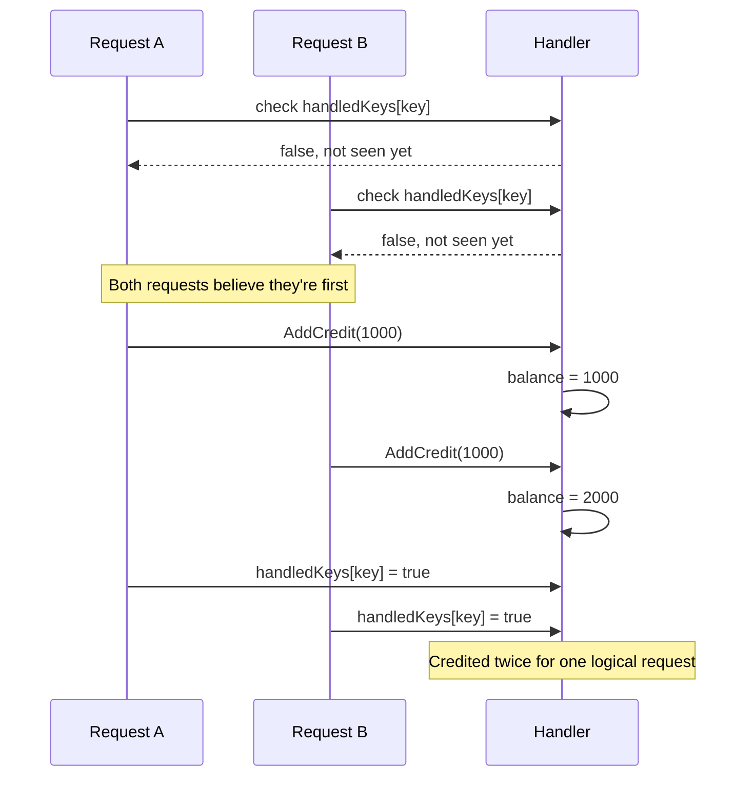
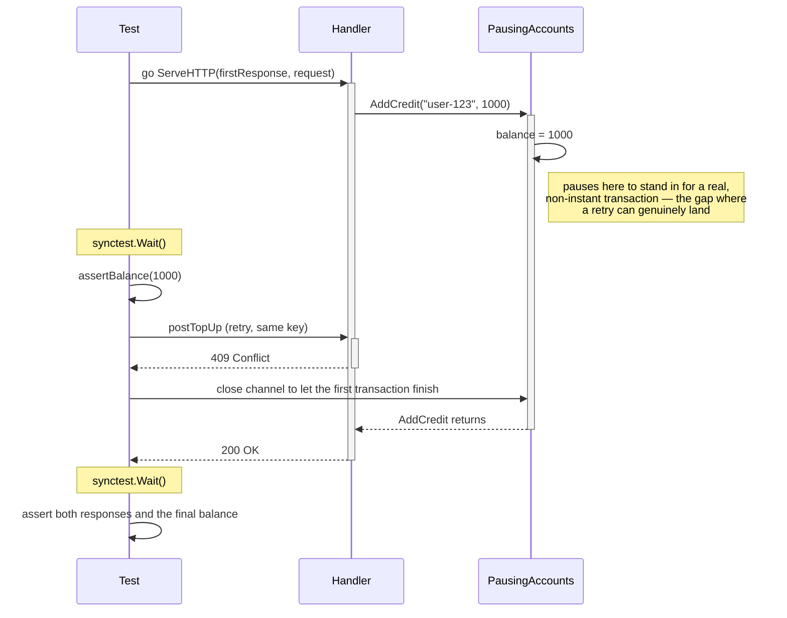

# Retryable endpoints

**[You can find all the code for this chapter here](https://github.com/quii/learn-go-with-tests/tree/main/retryable-endpoints)**

We are building an API that allows a system to add credit to an account. Bread and butter Go, at least on the happy path. But we're building a resilient [distributed system](https://en.wikipedia.org/wiki/Distributed_computing), so we need to think carefully about what happens when things go wrong.

Imagine a client is using a _[transactional outbox](https://microservices.io/patterns/data/transactional-outbox.html)_. If you're not familiar, it's enough to know that it's a list of pending work stored in a database. A worker picks up an item from the outbox, calls our API and then marks the item as done if the call succeeds.

What happens if the worker calls our API successfully, and then crashes before it can mark the item as done? When the worker restarts, it'll pick up the item, call the API again, and we will now accidentally increase the credit on the account again.

What we need to do is make our API friendly for retries. A fancier term for this is **[idempotency](https://en.wikipedia.org/wiki/Idempotence#Computer_science_meaning)**: repeating the same logical operation has the same intended effect as doing it once. Retrying a request should not add more to the account, but two separate requests should still deposit.

Sometimes we can design our APIs to be idempotent, almost out of the box. An [HTTP PUT](https://en.wikipedia.org/wiki/HTTP#Idempotent_method)'s semantics mean you update a resource in place, and if you do the same call again, the state of the resource is the same. GET should also follow these retryable semantics.

For operations that mustn't be repeated on retry we need some help: **idempotency keys**. Let’s use TDD to see how they work.

## Our starting point

None of this is really about idempotency yet, so let's skip the usual TDD dance for it and work backwards from the handler.

```go
func RetryableEndpoint(accounts Accounts) http.Handler {
	return http.HandlerFunc(func(w http.ResponseWriter, r *http.Request) {
		var topUp TopUpRequest
		if err := json.NewDecoder(r.Body).Decode(&topUp); err != nil {
			http.Error(w, err.Error(), http.StatusBadRequest)
			return
		}

		accounts.AddCredit(topUp.AccountID, topUp.AmountPence)
		w.WriteHeader(http.StatusOK)
	})
}
```

It decodes the request body into a `TopUpRequest`, then hands the numbers to an `Accounts` collaborator to actually apply the credit. The handler doesn't know or care how that's done; it just needs something that can add credit to an account.

Here is how the handler's dependency and payload type are defined.

```go
type Accounts interface {
	AddCredit(accountID string, amountPence int)
	Balance(accountID string) int
}

type TopUpRequest struct {
	AccountID   string `json:"account_id"`
	AmountPence int    `json:"amount_pence"`
}
```

As discussed in [Working Without Mocks](working-without-mocks.md), we prefer to model test-doubles as fakes rather than spies. So, for our tests, here's an in-memory `Accounts`:

```go
type InMemoryAccounts struct {
	balances map[string]int
}

func NewInMemoryAccounts() *InMemoryAccounts {
	return &InMemoryAccounts{balances: make(map[string]int)}
}

func (a *InMemoryAccounts) AddCredit(accountID string, amountPence int) {
	a.balances[accountID] += amountPence
}

func (a *InMemoryAccounts) Balance(accountID string) int {
	return a.balances[accountID]
}
```

Here's the happy path test. For brevity, we're leave testing invalid JSON out of this example.

```go
func TestCreditAccount(t *testing.T) {
	t.Run("adds credit to an account", func(t *testing.T) {
		accounts := NewInMemoryAccounts()
		handler := RetryableEndpoint(accounts)

		topUp := TopUpRequest{
			AccountID:   "user-123",
			AmountPence: 1000,
		}

		response := postTopUp(t, handler, topUp)

		assertStatus(t, response, http.StatusOK)
		assertBalance(t, accounts, "user-123", 1000)
	})
}
```

We have some test helpers - `postTopUp`, `assertStatus` and `assertBalance`.

```go
func postTopUp(t testing.TB, handler http.Handler, topUp TopUpRequest) *httptest.ResponseRecorder {
	t.Helper()

	payload, err := json.Marshal(topUp)
	if err != nil {
		t.Fatalf("could not marshal top-up request: %v", err)
	}

	req := httptest.NewRequest(http.MethodPost, "/top-up", bytes.NewReader(payload))
	req.Header.Set("Content-Type", "application/json")
	response := httptest.NewRecorder()
	handler.ServeHTTP(response, req)
	return response
}

func assertStatus(t testing.TB, response *httptest.ResponseRecorder, want int) {
	t.Helper()
	if response.Code != want {
		t.Errorf("got status %d, want %d; response body: %s", response.Code, want, response.Body.String())
	}
}

func assertBalance(t testing.TB, accounts Accounts, accountID string, want int) {
	t.Helper()
	if got := accounts.Balance(accountID); got != want {
		t.Errorf("got balance %d pence for account %q, want %d", got, accountID, want)
	}
}
```

To follow along, copy all this code into Go test file like `retryable_endpoint_test.go`.

Run it, and it should pass. Now we have the happy path tested, we can now get onto the spicier requirements, in a TDD fashion of course.

## Write the test first

Our clients are asking if we can support idempotency keys. They will generate one per logical top-up, and they expect us to use that key to make the endpoint idempotent. In practice this means if they retry with the same idempotency key, we will not top up again.

We'll generate the key with `uuid.New().String()`. Go 1.27 added a `uuid` package to the standard library so you can just `import "uuid"`.

```go
t.Run("credits the account only once when a request is retried", func(t *testing.T) {
	accounts := NewInMemoryAccounts()
	handler := RetryableEndpoint(accounts)

	topUp := TopUpRequest{
		AccountID:   "user-123",
		AmountPence: 1000,
	}

	idempotencyKey := uuid.New().String()

	res1 := postTopUp(t, handler, topUp, idempotencyKey)
	assertStatus(t, res1, http.StatusOK)
	assertBalance(t, accounts, "user-123", 1000)

	res2 := postTopUp(t, handler, topUp, idempotencyKey)
	assertStatus(t, res2, http.StatusOK)
	assertBalance(t, accounts, "user-123", 1000)
})
```

## Try to run the test

For this to compile, you'll need to update `postTopUp` to accept the key, and update the first test to pass it. You can just send an empty one for now.

```go
func postTopUp(t testing.TB, handler http.Handler, topUp TopUpRequest, idempotencyKey string) *httptest.ResponseRecorder {
	t.Helper()

	payload, err := json.Marshal(topUp)
	if err != nil {
		t.Fatalf("could not marshal top-up request: %v", err)
	}

	req := httptest.NewRequest(http.MethodPost, "/top-up", bytes.NewReader(payload))
	req.Header.Set("Content-Type", "application/json")
	req.Header.Set("Idempotency-Key", idempotencyKey)
	response := httptest.NewRecorder()
	handler.ServeHTTP(response, req)
	return response
}
```

```
--- FAIL: TestCreditAccount (0.00s)
    --- FAIL: TestCreditAccount/credits_the_account_only_once_when_a_request_is_retried (0.00s)
        endpoint_test.go:84: got balance 2000 pence for account "user-123", want 1000
```

As expected, our endpoint does not use the idempotency key, so it tops up twice.

## Write enough code to make it pass

We need to remember which keys we've already handled. A map will do for now.

```go
func RetryableEndpoint(accounts Accounts) http.Handler {
	handledKeys := make(map[string]bool)

	return http.HandlerFunc(func(w http.ResponseWriter, r *http.Request) {
		var topUp TopUpRequest
		if err := json.NewDecoder(r.Body).Decode(&topUp); err != nil {
			http.Error(w, err.Error(), http.StatusBadRequest)
			return
		}

		idempotencyKey := r.Header.Get("Idempotency-Key")

		if handledKeys[idempotencyKey] {
			w.WriteHeader(http.StatusOK)
			return
		}

		accounts.AddCredit(topUp.AccountID, topUp.AmountPence)
		handledKeys[idempotencyKey] = true
		w.WriteHeader(http.StatusOK)
	})
}
```

Our tests pass, but this simple implementation has some gaps:

- Empty keys are not handled well at all. After the first empty-key request, all others will be ignored! For this endpoint, we'll require a non-empty key.
- Checking the key and claiming it should be _atomic_: no other request should be able to slip between those steps. Two requests with the same key could both find it missing and both add credit before either records it. Accessing the map concurrently without synchronisation is also a data race.
- The map belongs to one handler instance. If we run several instances of our service, a retry could reach a different instance that hasn't seen the key and add credit again. Restarting the service also loses the keys. We'll need to share and persist this information to support horizontal scaling, which we'll explore later in the chapter.

Let's tackle these one at a time.

## Write the test first

Empty keys is the easiest one to fix. Update the first test to pass in a UUID as the key rather than an empty string, so we don't end up with two failing tests. Then, let's write a test to check what happens when the key is missing.

```go
t.Run("bad request when idempotency key is missing", func(t *testing.T) {
	accounts := NewInMemoryAccounts()
	handler := RetryableEndpoint(accounts)

	topUp := TopUpRequest{
		AccountID:   "user-123",
		AmountPence: 1000,
	}

	res := postTopUp(t, handler, topUp, "")
	assertStatus(t, res, http.StatusBadRequest)
	assertBalance(t, accounts, "user-123", 0)
})
```

## Try to run the test

```
--- FAIL: TestCreditAccount (0.00s)
    --- FAIL: TestCreditAccount/bad_request_when_idempotency_key_is_missing (0.00s)
        endpoint_test.go:107: got status 200, want 400; response body:
        endpoint_test.go:108: got balance 1000 pence for account "user-123", want 0
```

Fails as expected.

## Write enough code to make it pass

We just need to add a bit of validation to the header after we've extracted it from the request.

```go
if idempotencyKey == "" {
	http.Error(w, "missing idempotency key", http.StatusBadRequest)
	return
}
```

The test will now pass.

## Write the test first

So far, our client retries after the first request has finished. But what if it hasn't received a response and retries while the first request is still running? The account might already have been credited.

Here's how that goes wrong:



Both requests check the map before either has recorded anything in it, so both believe they're the first to see this key.

We could start two goroutines and hope they hit the handler at just the wrong moment. I'd rather have a test that fails every time we have this bug, not just when my laptop is having a busy day.

Let's arrange this sequence deliberately:

1. The first request checks its key and adds credit to the account.
2. We pause it before `AddCredit` returns, so the handler hasn't recorded the key or sent a response yet.
3. A second request arrives with the same key.
4. We let the first request finish and check that the account was only credited once.

There's also a response to consider. Previously, we returned `200 OK` for a retry because the original request had finished. For an operation still in progress, we'll choose to return `409 Conflict`, allowing the caller to retry later. Waiting for the first request to finish is another option, but we'll use the fail-fast approach here.

We'll use [`testing/synctest`](revisiting-time-with-synctest.md) to control the overlap. Remember that `synctest.Test` creates a bubble containing our test and its goroutines. `synctest.Wait()` waits until all the other goroutines in that bubble have finished or are *durably blocked*, such as waiting to receive from a channel created inside the bubble.

Add `"testing/synctest"` to your imports, then add this subtest. We'll implement `PausingAccounts` and `newTopUpRequest` next.

```go
t.Run("does not credit twice when a retry arrives before the first request completes", func(t *testing.T) {
	synctest.Test(t, func(t *testing.T) {
		accounts := NewInMemoryAccounts()
		resume := make(chan struct{})
		handler := RetryableEndpoint(&PausingAccounts{
			Accounts:  accounts,
			pauseNext: true,
			resume:    resume,
		})

		topUp := TopUpRequest{
			AccountID:   "user-123",
			AmountPence: 1000,
		}

		idempotencyKey := uuid.New().String()
		request := newTopUpRequest(t, topUp, idempotencyKey)
		firstResponse := httptest.NewRecorder()

		go handler.ServeHTTP(firstResponse, request)
		synctest.Wait()

		// The credit has been added, but the first request hasn't finished.
		assertBalance(t, accounts, "user-123", 1000)

		// The client hasn't received confirmation, so it retries the same top-up.
		retryResponse := postTopUp(t, handler, topUp, idempotencyKey)

		close(resume)
		synctest.Wait()

		assertStatus(t, firstResponse, http.StatusOK)
		assertStatus(t, retryResponse, http.StatusConflict)
		assertBalance(t, accounts, "user-123", 1000)
	})
})
```

The interleaving is the whole point here, and it's a lot to hold in your head from the code alone. Here's the same sequence as a diagram:



`PausingAccounts` stands in for that slow transaction, and blocking on a channel receive is what makes the window deterministic rather than hoped-for: the retry only proceeds once we know the first request has genuinely reached that point. That's what earns it its own activation bar, nested inside the first request's still-open one — a real overlap, not a guessed one. The two calls to `synctest.Wait()` do different jobs:

1. The first lets the handler reach the pause. We can then check the balance and send the retry while the first request is still in progress.
2. After we close `resume`, the second lets the first handler finish. We can then safely inspect its response and the final balance.

No sleeps required. We're controlling the order of events, rather than guessing how long they take.

## Write the minimal amount of code for the test to run and check the failing test output

We need a way to pause the account operation without adding test-specific behaviour to our handler. As in [Working Without Mocks](working-without-mocks.md#off-the-happy-path-with-decorators), we can decorate our fake.

```go
type PausingAccounts struct {
	Accounts
	pauseNext bool
	resume    <-chan struct{}
}

func (a *PausingAccounts) AddCredit(accountID string, amountPence int) {
	a.Accounts.AddCredit(accountID, amountPence)

	if a.pauseNext {
		a.pauseNext = false
		<-a.resume
	}
}
```

Embedding `Accounts` lets us keep using the fake's `Balance` method. We only change how `AddCredit` behaves:

1. Delegate to the fake to add the credit.
2. If this call should pause, set `pauseNext` to `false` so the retry won't pause too.
3. Wait for the test to close `resume` before returning to the handler.

Notice that we're pausing *after* changing the balance. The work has happened, but the handler hasn't yet recorded that fact. That's the gap we want to expose.

This decorator relies on our controlled ordering: the first `synctest.Wait()` lets the first request reach the channel receive before we start the second request. It isn't a general-purpose, concurrency-safe accounts implementation.

We also need to separate constructing a request from sending it. Our existing helper can call `t.Fatalf` if JSON encoding fails, and fatal test methods must be called from the test goroutine. Let's do that preparation before starting the handler's goroutine.

Extract the request construction into `newTopUpRequest`:

```go
func newTopUpRequest(t testing.TB, topUp TopUpRequest, idempotencyKey string) *http.Request {
	t.Helper()

	payload, err := json.Marshal(topUp)
	if err != nil {
		t.Fatalf("could not marshal top-up request: %v", err)
	}

	req := httptest.NewRequest(http.MethodPost, "/top-up", bytes.NewReader(payload))
	req.Header.Set("Content-Type", "application/json")
	req.Header.Set("Idempotency-Key", idempotencyKey)
	return req
}
```

Our existing tests can keep using `postTopUp`, which now delegates to the new helper:

```go
func postTopUp(t testing.TB, handler http.Handler, topUp TopUpRequest, idempotencyKey string) *httptest.ResponseRecorder {
	t.Helper()

	req := newTopUpRequest(t, topUp, idempotencyKey)
	response := httptest.NewRecorder()
	handler.ServeHTTP(response, req)
	return response
}
```

Run the new test:

```sh
go test ./retryable-endpoints -run 'TestCreditAccount/does_not_credit_twice'
```

```text
--- FAIL: TestCreditAccount (0.00s)
    --- FAIL: TestCreditAccount/does_not_credit_twice_when_a_retry_arrives_before_the_first_request_completes (0.00s)
        endpoint_test.go:161: got status 200, want 409; response body:
        endpoint_test.go:162: got balance 2000 pence for account "user-123", want 1000
```

Both requests added credit. When the retry checked the map, the first request hadn't recorded its key yet, so the retry went ahead and returned `200 OK` too.

You can also run this with `-race`. This test fails its assertions without a race-detector report: we've deliberately ordered the accesses using `synctest.Wait()` and the channel. The requests overlap, but they don't access the maps at the same instant. We've exposed a check-then-act bug, which the race detector alone can't catch.

Our handler needs to distinguish a key that's *in progress* from one that's *completed*, and checking and claiming a key must happen atomically. That's our next step.

## Write enough code to make it pass

We now need to check and claim a key as one operation. Let's put the map and its mutex together in a type that handles this for us. The handler can then ask to claim a key without managing locks itself.

There are three possible outcomes when we try to claim a key:

```go
type claimResult int

const (
	claimed claimResult = iota
	alreadyInProgress
	alreadyCompleted
)
```

`claimed` means this caller gets to do the work. The other two results tell it why it shouldn't. We'll store the result that *subsequent* callers should receive, so `claimed` itself never goes into the map.

Add `"sync"` to your imports and create the store:

```go
type IdempotencyStore struct {
	mu       sync.Mutex
	requests map[string]claimResult
}

func NewIdempotencyStore() *IdempotencyStore {
	return &IdempotencyStore{requests: make(map[string]claimResult)}
}

func (s *IdempotencyStore) Claim(key string) claimResult {
	s.mu.Lock()
	defer s.mu.Unlock()

	if result, exists := s.requests[key]; exists {
		return result
	}

	s.requests[key] = alreadyInProgress
	return claimed
}

func (s *IdempotencyStore) Complete(key string) {
	s.mu.Lock()
	defer s.mu.Unlock()

	s.requests[key] = alreadyCompleted
}
```

The important part of `Claim` is the scope of the lock:

1. Acquire the mutex before looking up the key.
2. If the key exists, return its recorded result.
3. Otherwise, record it as in progress and return `claimed`.

The deferred unlock happens as the method returns. No other caller can check the map between our lookup and insertion, so two requests can't both claim the same key.

The mutex is only held while we inspect or update the map. **The claim remains recorded after the mutex is released.** That lets a retry discover that the work is in progress without waiting for the work to finish.

Now replace the handler's map and inline checks with our store:

```go
func RetryableEndpoint(accounts Accounts) http.Handler {
	store := NewIdempotencyStore()

	return http.HandlerFunc(func(w http.ResponseWriter, r *http.Request) {
		var topUp TopUpRequest
		if err := json.NewDecoder(r.Body).Decode(&topUp); err != nil {
			http.Error(w, err.Error(), http.StatusBadRequest)
			return
		}

		idempotencyKey := r.Header.Get("Idempotency-Key")
		if idempotencyKey == "" {
			http.Error(w, "missing idempotency key", http.StatusBadRequest)
			return
		}

		switch store.Claim(idempotencyKey) {
		case alreadyInProgress:
			http.Error(w, "top-up is still in progress", http.StatusConflict)
		case alreadyCompleted:
			w.WriteHeader(http.StatusOK)
		case claimed:
			accounts.AddCredit(topUp.AccountID, topUp.AmountPence)
			store.Complete(idempotencyKey)
			w.WriteHeader(http.StatusOK)
		}
	})
}
```

Run the tests again, including with the race detector:

```sh
go test ./retryable-endpoints -race -count=10
```

They should pass. When our first request pauses, its key is already recorded as in progress, so the retry gets `409 Conflict` without adding any credit. Once the first request finishes, subsequent retries get `200 OK`.

The handler assumes its `Accounts` dependency supports concurrent calls; how it achieves that is the dependency's responsibility. Our concern here is preventing two requests with the same key from performing the same top-up twice.

The idempotency store is still local to one handler instance; we haven't solved persistence or horizontal scaling yet.

## Refactor

Our handler now knows rather a lot. It parses the request, claims a key, decides what to say if that key's already in progress, adds the credit, and records completion. That's more than translating HTTP into a domain call — [a handler's job is to decode the request, hand it to something else to do the actual work, and translate whatever comes back into a response](http-handlers-revisited.md), not to be the thing doing the work.

It's also a sign we drew the boundary between `Accounts` and `IdempotencyStore` in the wrong place. Claiming a key and adding the credit aren't two concerns that happen to run next to each other — they're one operation: idempotently applying a top-up. Right now the handler is the only place that knows both halves have to happen together, which is exactly the kind of coordination a handler shouldn't be doing.

That coordination has a concrete cost, not just a stylistic one: because the handler treats "claim, credit, complete" as three separate steps, what happens if the service stops between the last two?

If we put the balances and keys in a database but keep updating them independently, we still have a problem. The credit could be saved without its completion record. Moving the maps to Postgres wouldn't fix that on its own.

We need the credit and its completion record to succeed together. Let's give that responsibility to one operation, instead of asking our HTTP handler to coordinate it.

`Accounts` and `IdempotencyStore` did exactly what we needed them to: they let us build a working version, hit its exact failure mode, and name it precisely. That's been the value of this first half of the chapter — not that this code survives, but that we now understand, from a real failing test, exactly what an idempotent operation has to guarantee. That understanding is what points us at the more conventional shape: one operation owning the whole thing, rather than a handler stitching two collaborators together. From here, `Accounts` and `IdempotencyStore` step aside in favour of it. (The code as it stood is preserved at [v1](retryable-endpoints/v1/endpoint_test.go), if you'd like to compare.)

### An operation, not three separate steps

```go
type TopUpResult struct {
	AccountID    string `json:"account_id"`
	BalancePence int    `json:"balance_pence"`
}

var ErrMissingKey = errors.New("missing idempotency key")

type TopUps interface {
	Apply(ctx context.Context, key string, request TopUpRequest) (TopUpResult, error)
	Balance(ctx context.Context, accountID string) (int, error)
}
```

`Apply` promises to add credit once per key and return the original result when we retry. `Balance` lets us query the current state, just as we did with `Accounts`. The HTTP handler only needs `Apply`.

We're also giving the caller a result rather than an empty `200 OK`. It contains the balance immediately after *this* top-up. If another top-up happens before a retry, the retry should still return the first operation's recorded result, not today's balance.

The context and error let an implementation report a cancelled request or an unavailable database. For now, the only input validation we'll add is the existing requirement for a non-empty key. Callers must reuse the same payload when retrying a key; detecting mismatched payloads is a separate behaviour we could add later.

### Decide what happens during an overlapping call

This is also a change to our earlier policy. Instead of returning `409` while a top-up is running, this version waits for the operation to finish and replays its result. Both are reasonable choices, but they lead to different tests.

Waiting fits a database transaction protected by a unique constraint: a competing insert can wait for the first transaction's outcome. It also means our abstraction doesn't need to expose the intermediate claim state.

This isn't just moving code around. We're changing the overlapping-request behaviour and adding a response body, so let's make those promises explicit in our tests.

### A contract we can reuse

We're going to end up with more than one implementation of `TopUps`. The in-memory version we're about to write is fine for understanding the design, but a real service needs something durable that can be shared across more than one running instance, which is why we'll build a Postgres-backed version later in the chapter.

The fake earns its keep well before then, too. It's what lets us test the handler, and later write acceptance tests, without a real database running for every one of them. That's only trustworthy if the fake genuinely behaves the way Postgres will, which is exactly what a contract is for, as [Working Without Mocks](working-without-mocks.md#the-maintenance-costs-of-fakes) put it:

> By having a contract, we can assume that we can use a fake and an actual dependency interchangeably.

So let's describe the behaviour once and run it against each implementation, rather than writing this test twice. The factory gives each scenario fresh, isolated state; a database version can also register cleanup with `t.Cleanup`.

```go
type TopUpsContract struct {
	New func(t testing.TB) TopUps
}
```

Here's the replay scenario from the contract in [topups_contract_test.go](retryable-endpoints/topups_contract_test.go):

```go
func (c TopUpsContract) Test(t *testing.T) {
	t.Run("replays the original result even after another top-up", func(t *testing.T) {
		topUps := c.New(t)
		request := TopUpRequest{AccountID: "user-123", AmountPence: 1000}
		first, err := topUps.Apply(t.Context(), "first", request)
		if err != nil {
			t.Fatalf("could not apply top-up: %v", err)
		}

		// Identical payload, different key: a genuinely new top-up.
		second, err := topUps.Apply(t.Context(), "second", request)
		if err != nil {
			t.Fatalf("could not apply top-up: %v", err)
		}
		assertResult(t, second, TopUpResult{AccountID: "user-123", BalancePence: 2000})

		replayed, err := topUps.Apply(t.Context(), "first", request)
		if err != nil {
			t.Fatalf("could not apply top-up: %v", err)
		}
		assertResult(t, replayed, first)
		assertBalance(t, topUps, "user-123", 2000)
	})
}
```

We're calling `topUps.Apply` directly rather than wrapping it in a helper. It's the thing this contract is testing, so we want it visible at every call site, not hidden behind a name that could just as easily be doing something else. `assertResult` and `assertBalance` do the same jobs as before: compare results and query the balance.

```go
func assertResult(t testing.TB, got, want TopUpResult) {
	t.Helper()
	if got != want {
		t.Errorf("got result %+v, want %+v", got, want)
	}
}

func assertBalance(t testing.TB, topUps TopUps, accountID string, want int) {
	t.Helper()
	got, err := topUps.Balance(t.Context(), accountID)
	if err != nil {
		t.Fatalf("could not read balance: %v", err)
	}
	if got != want {
		t.Errorf("got balance %d pence for account %q, want %d", got, accountID, want)
	}
}
```

This `assertBalance` takes a `TopUps` rather than an `Accounts` — it replaces the version we wrote earlier, it doesn't overload it.

The full contract also checks:

1. A top-up credits the right account and returns its balance.
2. A missing key is rejected without changing the balance.
3. Concurrent attempts with the same key all return the same result and add credit once.
4. Concurrent top-ups with different keys all contribute to the balance.

For the concurrent scenarios, the contract releases several goroutines from a shared start channel and collects their results. It doesn't use `synctest`, so the same scenarios can run against an implementation doing real database I/O. That start signal doesn't force a particular interleaving; we'll still need database-specific tests for transaction contention and rollback.

### Keep the balance and result together

Our in-memory implementation owns both maps. It holds one mutex from checking the key through to recording the balance and result:

```go
type InMemoryTopUps struct {
	mu       sync.Mutex
	balances map[string]int
	results  map[string]TopUpResult
}

func NewInMemoryTopUps() *InMemoryTopUps {
	return &InMemoryTopUps{
		balances: make(map[string]int),
		results:  make(map[string]TopUpResult),
	}
}

func (s *InMemoryTopUps) Apply(ctx context.Context, key string, request TopUpRequest) (TopUpResult, error) {
	if key == "" {
		return TopUpResult{}, ErrMissingKey
	}

	s.mu.Lock()
	defer s.mu.Unlock()

	if err := ctx.Err(); err != nil {
		return TopUpResult{}, err
	}
	if result, exists := s.results[key]; exists {
		return result, nil
	}

	s.balances[request.AccountID] += request.AmountPence
	result := TopUpResult{
		AccountID:    request.AccountID,
		BalancePence: s.balances[request.AccountID],
	}
	s.results[key] = result
	return result, nil
}

func (s *InMemoryTopUps) Balance(ctx context.Context, accountID string) (int, error) {
	s.mu.Lock()
	defer s.mu.Unlock()

	if err := ctx.Err(); err != nil {
		return 0, err
	}
	return s.balances[accountID], nil
}
```

There are no network calls inside the lock, just a few map operations. For this implementation, serialising all top-ups is a simple way to uphold the contract. Another implementation could allow unrelated accounts to be updated concurrently.

Notice that the mutex protects the *whole operation*, including balance queries. Other callers cannot observe the balance change before we've stored its result. This is why we no longer have a separately injected `Accounts` and `IdempotencyStore` to coordinate.

This is still an in-memory implementation, not a durable transaction. A process restart loses both maps. What we've gained is a boundary where a database implementation can commit the balance and result together, without changing the handler.

Run the contract against it:

```go
func TestInMemoryTopUps(t *testing.T) {
	TopUpsContract{New: func(t testing.TB) TopUps {
		return NewInMemoryTopUps()
	}}.Test(t)
}
```

## Refactor

In a real system we'd likely have more than one idempotent operation — refunds, cancellations, whatever else needs retry-safety — and each would need this same claim-then-replay mechanism. Right now it's tangled up with the balance bookkeeping inside `InMemoryTopUps`. Let's pull the two apart: a generic piece that only knows about idempotency keys, and a domain-specific piece that only knows about balances.

```go
// Idempotent wraps a plain operation so repeated calls with the same key
// run it once and replay the stored result thereafter.
type Idempotent[Req, Res any] struct {
	mu      sync.Mutex
	results map[string]Res
	work    func(Req) (Res, error)
}

func NewIdempotent[Req, Res any](work func(Req) (Res, error)) *Idempotent[Req, Res] {
	return &Idempotent[Req, Res]{results: make(map[string]Res), work: work}
}

func (s *Idempotent[Req, Res]) Apply(ctx context.Context, key string, request Req) (Res, error) {
	var zero Res
	if key == "" {
		return zero, ErrMissingKey
	}

	s.mu.Lock()
	defer s.mu.Unlock()

	if err := ctx.Err(); err != nil {
		return zero, err
	}
	if result, exists := s.results[key]; exists {
		return result, nil
	}

	result, err := s.work(request)
	if err != nil {
		return zero, err
	}
	s.results[key] = result
	return result, nil
}
```

`Req` and `Res` let this same type serve a top-up, a refund, or anything else with its own request and result shapes. `InMemoryTopUps` just needs to supply the domain-specific work:

```go
type InMemoryTopUps struct {
	*Idempotent[TopUpRequest, TopUpResult]
	balances map[string]int
}

func NewInMemoryTopUps() *InMemoryTopUps {
	s := &InMemoryTopUps{balances: make(map[string]int)}
	s.Idempotent = NewIdempotent(func(request TopUpRequest) (TopUpResult, error) {
		s.balances[request.AccountID] += request.AmountPence
		return TopUpResult{
			AccountID:    request.AccountID,
			BalancePence: s.balances[request.AccountID],
		}, nil
	})
	return s
}
```

Embedding `*Idempotent[TopUpRequest, TopUpResult]` gives `InMemoryTopUps` its `Apply` method for free. From the outside nothing has changed: `TopUps` is the same interface, and the handler still just calls `Apply` without knowing any of this is composed from two pieces now.

`Balance` is where the sharp edge is. We were careful earlier that the mutex protects the *whole operation*, "including balance queries" — a caller must never see a credit applied before its result is recorded. Move that guarantee into a generic type and it's easy to lose without noticing, because it's tempting to just read the map directly:

```go
// Don't do this: reads outside Apply's lock.
func (s *InMemoryTopUps) Balance(ctx context.Context, accountID string) (int, error) {
	return s.balances[accountID], nil
}
```

I tried exactly that, then stress-tested it: fifty goroutines calling `Apply` and `Balance` concurrently on the same account, under `-race`.

```go
func TestInMemoryTopUpsBalanceDuringConcurrentApply(t *testing.T) {
	topUps := NewInMemoryTopUps()
	var wg sync.WaitGroup
	for i := range 50 {
		wg.Add(2)
		go func() {
			defer wg.Done()
			topUps.Apply(t.Context(), fmt.Sprintf("key-%d", i), TopUpRequest{AccountID: "user-123", AmountPence: 10})
		}()
		go func() {
			defer wg.Done()
			topUps.Balance(t.Context(), "user-123")
		}()
	}
	wg.Wait()
}
```

```text
WARNING: DATA RACE
Read at 0x00c0001b80e8 by goroutine 33:
  github.com/quii/learn-go-with-tests/retryable-endpoints.(*InMemoryTopUps).Balance()
      topups.go:91 +0xc8

Previous write at 0x00c0001b80e8 by goroutine 24:
  github.com/quii/learn-go-with-tests/retryable-endpoints.NewInMemoryTopUps.func1()
      topups.go:81 +0xa0
  github.com/quii/learn-go-with-tests/retryable-endpoints.(*Idempotent[...]).Apply()
      topups.go:57 +0x148
==================
```
(trimmed — the full trace also lists where each goroutine was created)

That's the same class of bug as check-then-act, just relocated: `results` is protected, `balances` quietly isn't. Generalising the idempotency piece is only safe if reads go through the same lock as writes, so `Idempotent` needs a way to offer that:

```go
// Query runs read under the same lock Apply uses, so a caller can never
// observe work's side effects before Apply has finished recording its result.
func (s *Idempotent[Req, Res]) Query(read func()) {
	s.mu.Lock()
	defer s.mu.Unlock()
	read()
}
```

```go
func (s *InMemoryTopUps) Balance(ctx context.Context, accountID string) (int, error) {
	if err := ctx.Err(); err != nil {
		return 0, err
	}
	var balance int
	s.Query(func() { balance = s.balances[accountID] })
	return balance, nil
}
```

With `Balance` going through `Query`, the same stress test passes clean under `-race`, and the existing contract still passes unchanged — `TopUpsContract` doesn't know or care that `InMemoryTopUps` is built on a generic type now.

The real payoff of splitting this out: the tricky concurrency proof — the `synctest` scenario, the "many concurrent calls with the same key only run once" check — only has to be written once, against `Idempotent` itself. Every future fake built on it inherits that guarantee, rather than each one needing its own from-scratch concurrency test.

That's the same idea [Working Without Mocks](working-without-mocks.md#enter-fakes) already showed us: fakes as composable pieces you snap together like Lego bricks, rather than a bespoke test double for every dependency. `Idempotent` is just another brick now — `InMemoryTopUps` reads more clearly for not spelling out the claim-then-replay mechanism inline, and the next fake that needs retry-safety gets it for free.

This is specifically a fakes-side refactor. `PostgresTopUps`'s atomicity comes from a unique constraint and a transaction, not from a wrapped Go closure, so it doesn't need — or benefit from — the same treatment.

Run everything again to confirm nothing broke:

```sh
go test ./retryable-endpoints/... -race -count=10
```

### The handler becomes an HTTP adapter

The handler now decodes the request, applies the top-up and translates the result into HTTP:

```go
func RetryableEndpoint(topUps TopUps) http.Handler {
	return http.HandlerFunc(func(w http.ResponseWriter, r *http.Request) {
		var request TopUpRequest
		if err := json.NewDecoder(r.Body).Decode(&request); err != nil {
			http.Error(w, err.Error(), http.StatusBadRequest)
			return
		}

		result, err := topUps.Apply(r.Context(), r.Header.Get("Idempotency-Key"), request)
		if errors.Is(err, ErrMissingKey) {
			http.Error(w, err.Error(), http.StatusBadRequest)
			return
		}
		if err != nil {
			http.Error(w, "could not top up account", http.StatusInternalServerError)
			return
		}

		w.Header().Set("Content-Type", "application/json")
		// Once writing starts, an encoding/write error cannot change the status.
		// The completed result remains available for a retry.
		_ = json.NewEncoder(w).Encode(result)
	})
}
```

Writing the JSON starts the response with the default `200 OK`. If the client disappears while we're writing, the completed top-up remains recorded. That's exactly why we needed retries to be safe.

That's still one Go value living in one process, though. Run two instances of our service, each with their own `InMemoryTopUps`, and a retry that lands on a different instance won't find the key at all — it'll look brand new, and get credited again. Horizontal scaling needs the claim and the result to live somewhere every instance can see, not in one process's memory. We'll get there with Postgres shortly — first, let's make sure our concurrency coverage still holds up after the redesign.

### Retrying before the first response arrives

The shape is the same as the earlier `synctest` scenario — pause, check the balance, retry, resume, check the result — but it pauses in a different place and decorates a different dependency, so it's worth seeing in full rather than just describing.

A top-up now returns a JSON body instead of an empty `200 OK`, so comparing two responses means decoding them first:

```go
func readResult(t testing.TB, response *httptest.ResponseRecorder) TopUpResult {
	t.Helper()
	var result TopUpResult
	if err := json.NewDecoder(response.Body).Decode(&result); err != nil {
		t.Fatalf("could not decode top-up result: %v", err)
	}
	return result
}
```

As before, we decorate our dependency to pause partway through — this time `TopUps` rather than `Accounts`:

```go
type PausingTopUps struct {
	TopUps
	resume <-chan struct{}
}

func (p *PausingTopUps) Apply(ctx context.Context, key string, request TopUpRequest) (TopUpResult, error) {
	result, err := p.TopUps.Apply(ctx, key, request)
	<-p.resume
	return result, err
}
```

Unlike `PausingAccounts`, this one doesn't need a `pauseNext` flag. `Apply` has already recorded the result by the time we pause, so a retry hitting the same underlying `TopUps` is served straight from the store — it never reaches this decorated method at all. Only the first handler needs decorating:

```go
t.Run("retry succeeds before the first response reaches the caller", func(t *testing.T) {
	synctest.Test(t, func(t *testing.T) {
		topUps := NewInMemoryTopUps()
		resume := make(chan struct{})
		firstHandler := RetryableEndpoint(&PausingTopUps{TopUps: topUps, resume: resume})
		secondHandler := RetryableEndpoint(topUps)
		request := TopUpRequest{AccountID: "user-123", AmountPence: 1000}
		key := uuid.New().String()
		firstRequest := newTopUpRequest(t, request, key)
		firstResponse := httptest.NewRecorder()

		go firstHandler.ServeHTTP(firstResponse, firstRequest)
		synctest.Wait()

		// Apply has completed, but the first handler hasn't received its result.
		assertBalance(t, topUps, "user-123", 1000)
		retry := postTopUp(t, secondHandler, request, key)
		close(resume)
		synctest.Wait()

		assertStatus(t, firstResponse, http.StatusOK)
		assertStatus(t, retry, http.StatusOK)
		assertResult(t, readResult(t, retry), readResult(t, firstResponse))
		assertBalance(t, topUps, "user-123", 1000)
	})
})
```

It decorates only the first handler's dependency, so the second handler retries through the same, undecorated `TopUps`. Both calls now receive `200 OK` and the same result.

That is deliberately different from pausing halfway through `AddCredit`. We've moved the atomic operation behind our interface; the HTTP test no longer reaches inside it. The contract checks concurrent calls, while the HTTP test tells the story of a caller that hasn't received confirmation.

Run it with:

```sh
go test ./retryable-endpoints/... -race -count=10
```

We now have a contract for a Postgres adapter to fulfil: keep the credit and its result in one transaction, and replay that result on a retry. The reusable scenarios stay the same; the database-specific tests will establish that its transaction and recovery behaviour really work.

## A Postgres implementation

A database is that shared resource. Postgres specifically is a good fit here because it already has transactions, which are exactly the locking mechanism idempotency needs — we don't have to invent our own distributed lock. We just need to use the one it already gives us correctly.

This part isn't really about idempotency any more, it's about Postgres, so we won't build it up through TDD the way we did the rest of the chapter. Here's a finished implementation, and the proof that it holds up: the exact same `TopUpsContract` we already wrote, run against it instead of `InMemoryTopUps`.

The schema is deliberately small, two tables, created directly in the test setup:

```sql
CREATE TABLE accounts (
    account_id TEXT PRIMARY KEY,
    balance_pence BIGINT NOT NULL
);
CREATE TABLE top_up_results (
    idempotency_key TEXT PRIMARY KEY,
    account_id TEXT,
    balance_pence BIGINT
);
```

And here's the whole implementation ([postgres.go](retryable-endpoints/postgres.go)):

```go
type PostgresTopUps struct {
	db *sql.DB
}

func NewPostgresTopUps(db *sql.DB) *PostgresTopUps {
	return &PostgresTopUps{db: db}
}

func (s *PostgresTopUps) Apply(ctx context.Context, key string, request TopUpRequest) (TopUpResult, error) {
	if key == "" {
		return TopUpResult{}, ErrMissingKey
	}

	tx, err := s.db.BeginTx(ctx, &sql.TxOptions{Isolation: sql.LevelReadCommitted})
	if err != nil {
		return TopUpResult{}, fmt.Errorf("begin top-up: %w", err)
	}
	defer tx.Rollback()

	claim, err := tx.ExecContext(ctx, `
		INSERT INTO top_up_results (idempotency_key) VALUES ($1)
		ON CONFLICT (idempotency_key) DO NOTHING`, key)
	if err != nil {
		return TopUpResult{}, fmt.Errorf("claim top-up: %w", err)
	}
	inserted, err := claim.RowsAffected()
	if err != nil {
		return TopUpResult{}, fmt.Errorf("read claim outcome: %w", err)
	}

	var result TopUpResult
	if inserted == 0 {
		// At READ COMMITTED, this new statement sees the competing transaction's
		// committed result, even if our INSERT had to wait for it.
		err = tx.QueryRowContext(ctx, `
			SELECT account_id, balance_pence FROM top_up_results
			WHERE idempotency_key = $1`, key).Scan(&result.AccountID, &result.BalancePence)
		if err != nil {
			return TopUpResult{}, fmt.Errorf("read top-up result: %w", err)
		}
		return result, nil
	}

	result.AccountID = request.AccountID
	err = tx.QueryRowContext(ctx, `
		INSERT INTO accounts (account_id, balance_pence) VALUES ($1, $2)
		ON CONFLICT (account_id) DO UPDATE
		SET balance_pence = accounts.balance_pence + EXCLUDED.balance_pence
		RETURNING balance_pence`, request.AccountID, request.AmountPence).Scan(&result.BalancePence)
	if err != nil {
		return TopUpResult{}, fmt.Errorf("add credit: %w", err)
	}

	_, err = tx.ExecContext(ctx, `
		UPDATE top_up_results SET account_id = $2, balance_pence = $3
		WHERE idempotency_key = $1`, key, result.AccountID, result.BalancePence)
	if err != nil {
		return TopUpResult{}, fmt.Errorf("record top-up result: %w", err)
	}
	if err := tx.Commit(); err != nil {
		return TopUpResult{}, fmt.Errorf("commit top-up: %w", err)
	}
	return result, nil
}

func (s *PostgresTopUps) Balance(ctx context.Context, accountID string) (int, error) {
	var balance int
	err := s.db.QueryRowContext(ctx, `
		SELECT balance_pence FROM accounts WHERE account_id = $1`, accountID).Scan(&balance)
	if errors.Is(err, sql.ErrNoRows) {
		return 0, nil
	}
	if err != nil {
		return 0, fmt.Errorf("read balance: %w", err)
	}
	return balance, nil
}
```

A few things worth noticing:

- **The unique constraint on `idempotency_key` is the lock.** `INSERT ... ON CONFLICT DO NOTHING` is our claim: if another transaction, in another process, is already inserting the same key, Postgres makes ours wait for its outcome rather than letting both proceed. That's the coordination we couldn't get from an in-memory mutex.
- **The arithmetic happens inside Postgres too**, via `ON CONFLICT DO UPDATE ... EXCLUDED`, for the same reason as the claim: reading a balance into Go, adding to it, and writing it back would be check-then-act all over again, just with a network hop in the middle.
- **The balance change and the result are written and committed together, in one transaction.** If either fails, neither survives, so a retry always finds either nothing or a complete result to replay.
- **The transaction is pinned to `READ COMMITTED` explicitly.** The "read the winner's result" path depends on a fresh statement seeing whatever the competing transaction committed, which is exactly what that isolation level guarantees.

Now let's prove it against the contract we already have:

```go
func TestPostgresTopUps(t *testing.T) {
	if testing.Short() {
		t.Skip("Postgres integration test requires Docker")
	}
	db, _ := newPostgresDB(t)

	TopUpsContract{New: func(t testing.TB) TopUps {
		resetPostgres(t, db)
		return NewPostgresTopUps(db)
	}}.Test(t)
}
```

Same assertions, same scenarios, nothing rewritten, `TopUpsContract` doesn't know or care whether it's talking to a map or a database. `newPostgresDB` starts a real instance with [Testcontainers](https://golang.testcontainers.org/modules/postgres/), opens a connection and creates the schema above; the full setup, along with two extra tests for things only a real database can prove, is in [postgres_test.go](retryable-endpoints/postgres_test.go). You'll need Docker running, and the dependencies installed:

```sh
go get github.com/jackc/pgx/v5/stdlib@v5.11.0 github.com/testcontainers/testcontainers-go/modules/postgres@v0.44.0
```

```sh
go test ./retryable-endpoints -run TestPostgresTopUps -v -timeout 3m
```

```text
--- PASS: TestPostgresTopUps (1.91s)
    --- PASS: TestPostgresTopUps/credits_an_account_and_returns_its_balance (0.00s)
    --- PASS: TestPostgresTopUps/replays_the_original_result_even_after_another_top-up (0.00s)
    --- PASS: TestPostgresTopUps/rejects_a_missing_key_without_adding_credit (0.00s)
    --- PASS: TestPostgresTopUps/concurrent_retries_all_return_the_same_result (0.01s)
    --- PASS: TestPostgresTopUps/concurrent_distinct_top-ups_do_not_lose_credit (0.01s)
    --- PASS: TestPostgresTopUps/replays_through_a_new_adapter_and_connection_pool (0.01s)
    --- PASS: TestPostgresTopUps/failure_to_record_the_result_rolls_back_the_credit_and_key (0.01s)
PASS
```

For everyday work on the handler or the in-memory implementation, `go test -short ./retryable-endpoints/...` skips the container test, so you're not paying the startup cost on every run.

We've kept this example focused on the transaction boundary. Key expiry, rejecting a reused key with a different payload, authentication and account validation still need deliberate policies in a real service. In particular, this example assumes a key identifies one top-up globally; an authenticated API would usually scope keys to the caller as well.

The handler hasn't changed. The operation's promise hasn't changed. We've replaced the in-memory mechanism with a transaction that can uphold that promise across separate service instances.

## Wrapping up

A client that can't tell "it worked" from "I didn't hear back" has no choice but to send the request again. So the question was never whether our endpoint gets called twice; it's what happens when it does.

Retries aren't an exotic edge case in a distributed system, they're an important tool for a high performing team building a distributed system that can be ran at scale. If your client systems cant reliably retry, you'll waste countless hours on support issues resolving trivial failures. 

### What we've covered

- **Idempotency and idempotency keys.** Repeating the same logical operation should have the same effect as doing it once; the client supplies a key per operation so the server can tell a retry from a genuinely new request.
- **Check-then-act** is the bug hiding inside "have we seen this key before?" — checking and claiming a key have to be one atomic step, or two requests can both decide they're the first.
- **Atomicity has to cover the whole operation, not just the claim.** That's what drove the redesign: one method, `Apply`, is responsible for claiming, crediting and completing, rather than an HTTP handler coordinating three separate steps.
- **Contracts and fakes**, as in [Working Without Mocks](working-without-mocks.md), let us describe the behaviour once and run it unchanged against an in-memory implementation and Postgres.
- **A unique constraint is a cross-process lock.** `INSERT ... ON CONFLICT DO NOTHING` lets Postgres pick a winner between two transactions claiming the same key, which is how that promise survives more than one instance of our service.
- We used [`testing/synctest`](revisiting-time-with-synctest.md) to arrange a retry-while-in-progress overlap deterministically, rather than hoping two goroutines collide at the right moment.

### Decisions we've left open

The mechanism is the easy half. A real service still has to pick a policy for each of these, and I'd rather make those choices explicitly than inherit them by accident:

- **What to say while a top-up is still running.** Our first version returned `409 Conflict` and invited the caller to try again later; the second waits for the outcome and replays the result. Both are reasonable, and they lead to different tests.
- **How long a key lives.** You can't keep them forever. Expiry turns a very late retry into a brand new top-up, so the window needs to comfortably outlast any retrying a client will plausibly do.
- **What a reused key with a different payload means.** We assumed callers replay the same request. Rejecting a mismatch is genuinely useful, and it's a separate behaviour with its own tests.
- **Who a key belongs to.** We treated keys as globally unique, which is fine for an example. An authenticated API would normally scope them to the caller, so one client can't collide with another's keys.

### Additional material

- [The Idempotency-Key HTTP Header Field](https://datatracker.ietf.org/doc/html/draft-ietf-httpapi-idempotency-key-header) is the IETF draft that standardises the header we've been setting, including what servers should do about mismatched payloads and concurrent requests.
- [Stripe's documentation on idempotent requests](https://docs.stripe.com/api/idempotent_requests) is a good look at how this is presented to clients of a real API, expiry window and all.
- [Implementing Stripe-like idempotency keys in Postgres](https://brandur.org/idempotency-keys) by Brandur Leach goes considerably further than we have, into multi-step operations where some steps are calls to other systems you can't roll back.
- [PostgreSQL: Transaction Isolation](https://www.postgresql.org/docs/current/transaction-iso.html) is worth reading properly if you're relying on transactions for correctness. Our adapter chose `READ COMMITTED` deliberately, and that choice only makes sense once you know what the alternatives promise.
