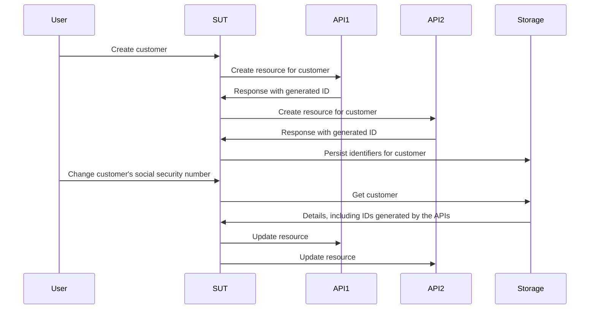

# Working without mocks, stubs and spies

This chapter delves into the world of test doubles and explores how they influence the testing and development process. We'll uncover the limitations of traditional mocks, stubs, and spies and introduce a more efficient and adaptable approach using fakes and contracts.

## tl;dr

- Mocks, spies and stubs encourage you to encode assumptions of the behaviour of your dependencies ad-hocly in each test.
- These assumptions are usually not validated beyond manual checking, so they threaten your test suite's usefulness.
- Fakes and contracts give us a more sustainable method for creating test doubles with validated assumptions and better reuse than the alternatives.

This is a longer chapter than normal, so as a palette cleanser, you should explore an [example repo first](https://github.com/quii/go-fakes-and-contracts). In particular, check out the [planner test](https://github.com/quii/go-fakes-and-contracts/blob/main/domain/planner/planner_test.go).

---

In [Mocking,](https://quii.gitbook.io/learn-go-with-tests/go-fundamentals/mocking) we learned how mocks, stubs and spies are useful tools for controlling and inspecting the behaviour of units of code in conjunction with [Dependency Injection](https://quii.gitbook.io/learn-go-with-tests/go-fundamentals/dependency-injection).

As a project grows, though, these kinds of test doubles *can* become a maintenance burden, and we should instead look to other design ideas to keep our system easy to reason and test.

**Fakes** and **contracts** allow developers to test their systems with more realistic scenarios, improve local development experience with faster and more accurate feedback loops, and manage the complexity of evolving dependencies.

### A primer on test doubles

It's easy to roll your eyes when people like me are pedantic about the nomenclature of test doubles, but the distinctive kinds of test doubles help us talk about this topic and the trade-offs we're making with clarity.

**Test doubles** is the collective noun for the different ways you can construct dependencies that you can control for a **subject under test** **(SUT)**, the thing you're testing. Test doubles are often a better alternative than using the real dependency as it can avoid issues like

- Needing the internet to use an API
- Avoid latency and other performance issues
- Unable to exercise non-happy path cases
- Decoupling your build from another team's.
  - You wouldn't want to prevent deployments if an engineer in another team accidentally shipped a bug

In Go, you'll typically model a dependency with an interface, then implement your version to control the behaviour in a test. **Here are the kinds of test doubles covered in this post**.

Given this interface of a hypothetical recipe API:

```go
type RecipeBook interface {
	GetRecipes() ([]Recipe, error)
	AddRecipes(...Recipe) error
}
```

We can construct test doubles in various ways, depending on how we're trying to test something that uses a `RecipeBook`.

**Stubs** return the same canned data every time they are called

```go
type StubRecipeStore struct {
	recipes []Recipe
	err error
}

func (s *StubRecipeStore) GetRecipes() ([]Recipe, error) {
	return s.recipes, s.err
}

// AddRecipes omitted for brevity

// in test, we can set up the stub to always return specific recipes, or an error
stubStore := &StubRecipeStore{recipes: someRecipes}
```

**Spies** are like stubs but also record how they were called so the test can assert that the SUT calls the dependencies in specific ways.

```go
type SpyRecipeStore struct {
	AddCalls [][]Recipe
	err error
}

func (s *SpyRecipeStore) AddRecipes(r ...Recipe) error {
	s.AddCalls = append(s.AddCalls, r)
	return s.err
}

// GetRecipes omitted for brevity

// in test
spyStore := &SpyRecipeStore{}
sut := NewThing(spyStore)
sut.DoStuff()

// now we can check the store had the right recipes added by inspectiong spyStore.AddCalls
```

**Mocks** are like a superset of the above, but they only respond with specific data to specific invocations. If the SUT calls the dependencies with the wrong arguments, it'll typically panic.

```go
// set up the mock with expected calls
mockStore := &MockRecipeStore
mockStore.WhenCalledWith(someRecipes).return(someError)

// when the sut uses the dependency, if it doesn't call it with someRecipes, usually mocks will panic
```

**Fakes** are like a genuine version of the dependency but implemented in a way more suited to fast running, reliable tests and local development. Often, your system will have some abstraction around persistence, which will be implemented with a database, but in your tests, you could use an in-memory fake instead.

```go
type FakeRecipeStore struct {
	recipes []Recipe
}

func (f *FakeRecipeStore) GetRecipes() ([]Recipe, error) {
	return f.recipes, nil
}

func (f *FakeRecipeStore) AddRecipes(r ...Recipe) error {
	f.recipes = append(f.recipes, r...)
	return nil
}
```

Fakes are useful because:

- Their statefulness is useful for tests involving multiple subjects and invocations, such as an integration test. Managing state with the other kinds of test doubles is generally discouraged.
- If they have a sensible API, offer a more natural way of asserting state. Rather than spying on specific calls to a dependency, you can query its final state to see if the real effect you want happened.
- You can use them to run your application locally without spinning up or depending on real dependencies. This will usually improve developer experience (DX) because the fakes will be faster and more reliable than their real counterparts.

Spies, Mocks and Stubs can typically be autogenerated from an interface using a tool or using reflection. However, as Fakes encode the behaviour of the dependency you're trying to make a double for, you'll have to write at least most of the implementation yourself

## The problem with stubs and mocks

In [Anti-patterns,](https://quii.gitbook.io/learn-go-with-tests/meta/anti-patterns) there are details on how using test doubles must be done carefully. Creating a messy test suite is easy if you don't use them tastefully. As a project grows though, other problems can creep in.

When you encode behaviour into test doubles, you are adding your assumptions as to how the real dependency works into the test. If there is a discrepancy between the behaviour of the double and the real dependency, or if one happens over time (e.g. the real dependency changes, which *has* to be expected), **you may have passing tests but failing software**.

Stubs, spies and mocks, in particular, represent other challenges, mainly as a project grows. To illustrate this, I will describe a project I worked on.

### Example case study

*Some details are changed compared to what really happened, and it has been simplified greatly for brevity. **Any resemblance to actual persons, living or dead, is purely coincidental.***

I worked on a system that had to call **six** different APIs, written and maintained by other teams across the globe. They were _REST-ish_, and the job of our system was to create and manage resources in them all. When we called all the APIs correctly for each system, _magic_ (business value) would happen.

Our application was structured in a hexagonal / ports & adapters architecture. Our domain code was decoupled from the mess of the outside world we had to deal with. Our "adapters" were, in effect, Go clients that encapsulated calling the various APIs.


#### Troubles

Naturally, we took a test-driven approach to building the system. We leveraged stubs to simulate the downstream API responses and had a handful of acceptance tests to reassure ourselves everything should work.

The APIs we had to call for the most part, though, were:

- poorly documented
- run by teams who had lots of other conflicting priorities and pressures, so it wasn't easy to get time with them
- often lacking test coverage, so would break in fun and unexpected ways, regress, etc
- were still being built and evolved

This led to **a lot of flaky tests** and a lot of headaches. A _significant_ amount of our time was spent pinging lots of busy people on Slack trying to get answers as to:

- Why has the API started doing `x`?
- Why is the API doing something different when we do `y`?

Software development is rarely as straightforward as you'd hope; it's a learning exercise. We had to continuously learn how the external APIs worked. As we learned and adapted, we had to update and add to our test suite, in particular, **changing our stubs to match the actual behaviour of the APIs.**

The trouble is, this took up much of our time and led to more mistakes. When your knowledge of a dependency changes, you must find the **right** test to update to change the stub's behaviour, and there's a real risk of neglecting to update it in other stubs representing the same dependency.

#### Test strategy

On top of this, as the system was growing and requirements were changing, we realised that our test strategy was unsuitable. We had a handful of acceptance tests that would give us confidence the system as a whole worked and then a large number of unit tests for the various packages we wrote.

<u>We needed something in between</u>; we often wanted to change the behaviour of various system parts together **but not have to spin up the *entire* system for an acceptance test**. Unit tests alone did not give us confidence that the various components worked as a whole; they couldn't tell (and verify) the story of what we were trying to achieve. **We wanted integration tests**.

#### Integration tests

Integration tests prove that two or more "units" work correctly when combined (or integrated!). These units can be the code you write or the code you write integrated with someone else's code, such as a database.

As a project grows, you want to write more integration tests to prove large parts of your system "hang together" - or integrates!

You may be tempted to write more black-box acceptance tests, but they quickly become costly regarding your build time and maintenance costs. It can be too expensive to spin up an entire system when you only want to check a *subset* of the system (but not just a single unit) behaves how it should. Writing expensive black-box tests for every bit of functionality you do is not sustainable for larger systems.

#### Enter: Fakes

The problem was the way our units were tested was reliant on stubs, which are, for the most part, *stateless*. We wanted to write tests covering multiple, *stateful* API calls, where we may create a resource at the start and then edit it later.

The following is a cut-down version of a test we want to do.

The SUT is a "service layer" dealing with "use case" requests. We want to prove if a customer is created, when their details change, we successfully update the resources we made in the respective APIs.

Here are the requirements given to the team as a user story.

> ***Given*** a user is registered with API 1, 2 and 3
>
> ***When*** the customer's social security number is changed
>
> ***Then**,* the change is propagated into APIs 1, 2 and 3



Tests that cut across multiple units are usually incompatible with stubs **because they're not suited to maintaining state**. We _could_ write a black-box acceptance test, but the costs of these tests would quickly spiral out of control.

In addition, it is complicated to test edge cases with a black-box test because you cannot control the dependencies. For instance, we wanted to prove that a rollback mechanism would be fired if one API call failed.

We needed to use **fakes**. By modelling our dependencies as stateful APIs with in-memory fakes, we were able to write integration tests with a much broader scope, **to allow us to test real use cases worked**, again *without* having to spin up the whole system, and instead have almost the same speed as unit tests.


Using fakes, **we can make assertions based on the final states of the respective systems rather than relying on complicated spying**. We'd ask each fake what records it held for the customer and assert they were updated. This feels more natural; if we manually checked our system, we would query those APIs to check their state, not inspect our request logs to see if we sent particular JSON payloads.

```go
// take our lego-bricks and assemble the system for the test
fakeAPI1 := fakes.NewAPI1()
fakeAPI2 := // etc..
customerService := customer.NewService(fakeAPI1, fakeAPI2, etc...)

// create new customer
newCustomerRequest := NewCustomerReq{...}
createdCustomer, err := customerService.New(newCustomerRequest)
assert.NoErr(t, err)

// we can verify all the details are as expected in the various fakes in a natural way, as if they're normal APIs
fakeAPI1Customer := fakeAPI1.Get(createdCustomer.FakeAPI1Details.ID)
assert.Equal(t, fakeAPI1Customer.SocialSecurityNumber, newCustomerRequest.SocialSecurityNumber)

// repeat for the other apis we care about

// update customer
updatedCustomerRequest := NewUpdateReq{SocialSecurityNumber: "123", InternalID: createdCustomer.InternalID}
assert.NoErr(t, customerService.Update(updatedCustomerRequest))

// again we can check the various fakes to see if the state ends up how we want it
updatedFakeAPICustomer := fakeAPI1.Get(createdCustomer.FakeAPI1Details.ID)
assert.Equal(t, updatedFakeAPICustomer.SocialSecurityNumber, updatedCustomerRequest.SocialSecurityNumber)
```

This is simpler to write and easier to read than checking various function call arguments made via spies.

This approach lets us have tests that cut across broad parts of our system, letting us write more **meaningful** tests about the use cases we'd be discussing at stand-up whilst still executing exceptionally quickly.

#### The maintenance costs of fakes

Fakes are costlier than other test doubles, at least in terms of code written; they must carry state and simulate the behaviour of whatever they're faking. Any discrepancies in behaviour between your fake and the real thing **carry a risk** that your tests aren't in line with reality. This leads to the scenario where you have passing tests but broken software.

Whenever you integrate with another system, be it another team's API or a database, you'll make assumptions based on its behaviour. These could be captured from API docs, in-person conversations, emails, Slack threads, etc.

Wouldn't it be helpful if we could **codify our assumptions** to run them against both our fake *and* the actual system to see if our knowledge is correct in a repeatable and documented way?

**Contracts** are the means to this end. They helped us manage the assumptions we made on the other team's systems and make them explicit. Way more explicit and useful than email exchanges or endless Slack threads!


By having a contract, we can assume that we can use a fake and an actual dependency interchangeably. This is not only useful for constructing tests but also for local development.

Here is an example of a contract for one of the APIs the system depends on

```go
type API1Customer struct {
	Name string
	ID   string
}

type API1 interface {
	CreateCustomer(ctx context.Context, name string) (API1Customer, error)
	GetCustomer(ctx context.Context, id string) (API1Customer, error)
	UpdateCustomer(ctx context.Context, id string, name string) error
}

type API1Contract struct {
	NewAPI1 func() API1
}

func (c API1Contract) Test(t *testing.T) {
	t.Run("can create, get and update a customer", func(t *testing.T) {
		var (
			ctx  = context.Background()
			sut  = c.NewAPI1()
			name = "Bob"
		)

		customer, err := sut.CreateCustomer(ctx, name)
		expect.NoErr(t, err)

		got, err := sut.GetCustomer(ctx, customer.ID)
		expect.NoErr(t, err)
		expect.Equal(t, customer, got)

		newName := "Robert"
		expect.NoErr(t, sut.UpdateCustomer(ctx, customer.ID, newName))

		got, err = sut.GetCustomer(ctx, customer.ID)
		expect.NoErr(t, err)
		expect.Equal(t, newName, got.Name)
	})

	// example of strange behaviours we didn't expect
	t.Run("the system will not allow you to add 'Dave' as a customer", func(t *testing.T) {
		var (
			ctx  = context.Background()
			sut  = c.NewAPI1()
			name = "Dave"
		)

		_, err := sut.CreateCustomer(ctx, name)
		expect.Err(t, ErrDaveIsForbidden)
	})
}
```

As discussed in [Scaling Acceptance Tests](https://quii.gitbook.io/learn-go-with-tests/testing-fundamentals/scaling-acceptance-tests), by testing against an interface rather than a concrete type, the test becomes:

- Decoupled from implementation detail
- Can be re-used in different contexts.

Which are the requirements for a contract. It allows us to verify and develop our fake _and_ test it against the actual implementation.

To create our in-memory fake, we can use the contract in a test.

```go
func TestInMemoryAPI1(t *testing.T) {
	API1Contract{NewAPI1: func() API1 {
		return inmemory.NewAPI1()
	}}.Test(t)
}
```

And here is the fake's code

```go
func NewAPI1() *API1 {
	return &API1{customers: make(map[string]planner.API1Customer)}
}

type API1 struct {
	i         int
	customers map[string]planner.API1Customer
}

func (a *API1) CreateCustomer(ctx context.Context, name string) (planner.API1Customer, error) {
	if name == "Dave" {
		return planner.API1Customer{}, ErrDaveIsForbidden
	}

	newCustomer := planner.API1Customer{
		Name: name,
		ID:   strconv.Itoa(a.i),
	}
	a.customers[newCustomer.ID] = newCustomer
	a.i++
	return newCustomer, nil
}

func (a *API1) GetCustomer(ctx context.Context, id string) (planner.API1Customer, error) {
	return a.customers[id], nil
}

func (a *API1) UpdateCustomer(ctx context.Context, id string, name string) error {
	customer := a.customers[id]
	customer.Name = name
	a.customers[id] = customer
	return nil
}
```

### Evolving software

Most software is not built and "finished" forever, in one release.

It's an incremental learning exercise, adapting to customer demands and other external changes. In the example, the APIs we were calling were also evolving and changing; plus, as we developed _our_ software, we learned more about what system we _really_ needed to make. Assumptions we made in our contracts turned out to be wrong or _became_ wrong.

Thankfully, once the setup for the contracts was made, we had a simple way to deal with change. Once we learned something new, as a result of a bug being fixed or a colleague informing us that the API was changing, we'd:

1. Write a test to exercise the new scenario. A part of this will involve changing the contract to **drive** you to simulate the behaviour in the fake
2. Running the test should fail, but before anything else, run the contract against the real dependency to ensure the change to the contract is valid.
3. Update the fake so it conforms to the contract.
4. Make the test pass.
5. Refactor.
6. Run all the tests and ship.

Running the _full_ test suite before checking in _may_ result in other tests failing due to the fake having a different behaviour. This is a **good thing**!  You can now fix all the other areas of the system depending on the changed system; confident they will also handle this scenario in production. Without this approach, you'd have to *remember* to find all the relevant tests and update the stubs. Error-prone, labourious and boring.

### Superior developer experience

Having the suite of fakes with corresponding contracts felt like a superpower. We could finally tame the complexity of the APIs we had to deal with.

Writing tests for various scenarios became much simpler. We no longer had to assemble a series of stubs and spies for every test; we could take our set of units or modules (the fakes, our own "services") and assemble them very easily to exercise the various weird and wonderful scenarios we needed.

Every test with a stub, spy or mock has to _care_ about how the external system behaves, due to the ad-hoc setup. On the other hand, fakes can be treated like any other well-encapsulated unit of code, where the details are hidden away from you, and you can just use them.

We could run a very realistic version of the system locally, and as it was all in memory, it would start and run extremely quickly. This meant our test times were extremely fast, which felt very impressive, given how comprehensive the suite was.

If our acceptance tests failed in our staging environment, our first step was to run our contracts against the APIs we depended on. We often identified issues **before the other systems' developers did**.

### Off the happy path with decorators

For error scenarios, stubs are more convenient because you have direct access to *how* it behaves in the test, whereas fakes tend to be fairly black-box. This is a deliberate design choice, as we want the users of them (e.g. tests) not to be concerned with how they work; they should trust they do the right thing due to the backing of the contract.

How do we make the fakes fail, to exercise non-happy path concerns?

There are plenty of scenarios where, as a developer, you need to modify the behaviour of some code without changing its source. The **decorator pattern** is often a way to take a unit of code and add things like logging, telemetry, retries and more. We can use it to wrap our fakes to override behaviours when necessary.

Returning to the `API1` example, we can create a type that implements the needed interface and wraps around the fake.

```go
type API1Decorator struct {
	delegate           API1
	CreateCustomerFunc func(ctx context.Context, name string) (API1Customer, error)
	GetCustomerFunc    func(ctx context.Context, id string) (API1Customer, error)
	UpdateCustomerFunc func(ctx context.Context, id string, name string) error
}

// assert API1Decorator implements API1
var _ API1 = &API1Decorator{}

func NewAPI1Decorator(delegate API1) *API1Decorator {
	return &API1Decorator{delegate: delegate}
}

func (a *API1Decorator) CreateCustomer(ctx context.Context, name string) (API1Customer, error) {
	if a.CreateCustomerFunc != nil {
		return a.CreateCustomerFunc(ctx, name)
	}
	return a.delegate.CreateCustomer(ctx, name)
}

func (a *API1Decorator) GetCustomer(ctx context.Context, id string) (API1Customer, error) {
	if a.GetCustomerFunc != nil {
		return a.GetCustomerFunc(ctx, id)
	}
	return a.delegate.GetCustomer(ctx, id)
}

func (a *API1Decorator) UpdateCustomer(ctx context.Context, id string, name string) error {
	if a.UpdateCustomerFunc != nil {
		return a.UpdateCustomerFunc(ctx, id, name)
	}
	return a.delegate.UpdateCustomer(ctx, id, name)
}
```

In our tests, we can then use the `XXXFunc` field to modify the behaviour of the test-double, just like you would with stubs, spies or mocks.

```go
failingAPI1 = NewAPI1Decorator(inmemory.NewAPI1())
failingAPI1.UpdateCustomerFunc = func(ctx context.Context, id string, name string) error {
	return errors.New("failed to update customer")
})
```

However, this _is_ awkward and requires you to exercise some judgement. With this approach, you are losing the guarantees from your contract as you are introducing ad-hoc behaviour to your fake in tests.

It would be best to examine your context, you may conclude it would be simpler to test specific unhappy paths at the unit test level using a stub.

### Isn't this extra code waste?

It is wishful thinking to believe we should only ever write code that serves customers and expect a system we can build on efficiently. People have a very warped opinion of what waste is (see my post: [The ghost of Henry Ford is ruining your development team](https://quii.dev/The_ghost_of_Henry_Ford_is_ruining_your_development_team)).

Automated tests do not directly benefit customers, but we write them to make ourselves more efficient with our work (you don't write tests to chase coverage scores, right?).

Engineers must easily simulate scenarios (in a repeatable fashion, not ad-hocly) to debug, test, and fix issues. **In-memory fakes and good modular design allow us to isolate the relevant actors for a scenario to write fast, appropriate tests extremely cheaply**. This flexibility enables developers to iterate on a system far more manageably than a tangled mess, tested via expensive to-write and run black-box tests or, worse, manual testing on a shared environment.

This is an example of [simple vs. easy](https://www.youtube.com/watch?v=SxdOUGdseq4). Of course, fakes and contracts will result in more code being written than stubs and spies in the short term, but the result is a more straightforward and cheaper-to-maintain system in the longer run. Updating spies, stubs and mocks piecemeal is labour-intensive and error-prone, as you won't have corresponding contracts to check your test doubles behave correctly.

This approach represents a _slightly_ increased upfront cost but with far lower costs once the contracts and fakes are set up. Fakes are more reusable and reliable than ad-hoc test doubles like stubs.

It feels *very* liberating and gives you **confidence** when using an existing, battle-tested fake rather than setting up a stub when writing a new test.

### How does this fit into TDD?

I wouldn't recommend _starting_ with a contract; that's bottom-up design, which, in general, I find I need to be more clever for, and there's a danger I'll overthink hypothetical requirements.

This technique is compatible with the "acceptance test driven approach" as discussed in earlier chapters, [The Why of TDD](https://quii.dev/The_Why_of_TDD) and in [GOOS](http://www.growing-object-oriented-software.com)

- Write a failing [acceptance test](https://quii.gitbook.io/learn-go-with-tests/testing-fundamentals/scaling-acceptance-tests).
- Drive out enough code to make it pass, which usually will result in some "service layer" that'll depend on an API, a database, or whatever. Usually, you will have business logic code decoupled from external concerns (such as persistence, calling a database, etc.) via an interface.
- Implement the interface with an in-memory fake at first to make all the tests pass locally and validate the initial design.
- To push to production, you can't use in-memory! Encode the assumptions you made against the fake into a contract.
- Use the contract to create the actual dependency, such as a MySQL version of a store.
- Ship.

##  Where's the chapter on testing databases?

This has been a common request that I have put off for over five years. The reason is this chapter will always be my answer.

<u>Don't mock the database driver and spy on calls</u>. These tests are difficult to write and potentially bring very little value. You shouldn't assert whether a particular `SQL` statement was sent to the database, that is, implementation detail; **your tests should only care about behaviour**. Proving a specific SQL statement was compiled _does not_ prove your code _behaves_ how you need it to.

**Contracts** force you to decouple your tests from implementation details and focus on behaviour.

Follow the TDD approach described above to drive out your persistence needs.

[The example repository](https://github.com/quii/go-fakes-and-contracts) has some examples of contracts, and how they're used to test in-memory and SQLite implementations of some persistence needs.

```go
package inmemory_test

import (
	"github.com/quii/go-fakes-and-contracts/adapters/driven/persistence/inmemory"
	"github.com/quii/go-fakes-and-contracts/domain/planner"
	"testing"
)

func TestInMemoryPantry(t *testing.T) {
	planner.PantryContract{
		NewPantry: func() planner.Pantry {
			return inmemory.NewPantry()
		},
	}.Test(t)
}
```

```go
package sqlite_test

import (
	"github.com/quii/go-fakes-and-contracts/adapters/driven/persistence/sqlite"
	"github.com/quii/go-fakes-and-contracts/domain/planner"
	"testing"
)

func TestSQLitePantry(t *testing.T) {
	client := sqlite.NewSQLiteClient()
	t.Cleanup(func() {
		if err := client.Close(); err != nil {
			t.Error(err)
		}
	})

	planner.PantryContract{
		NewPantry: func() planner.Pantry {
			return sqlite.NewPantry(client)
		},
	}.Test(t)
}
```

Whilst Docker et al. _do_ make running databases locally easier, they can still carry a significant performance overhead. Fakes with contracts allow you to use restrict the need to use the "heavier" dependency to only when you're validating the contract, and not needed for other kinds of tests.

Using in-memory fakes for acceptance and integration tests for *the rest* of the system provides a much faster and simpler developer experience.

## Wrapping up

It’s common for software projects to be organised with various teams building systems concurrently to try to reach a common goal.

This method of work requires a high degree of collaboration and communication. Many feel with an "API first" approach, we can define some API contracts (often on a wiki page!) and then work independently for six months and stick it all together. This rarely works well in practice because as we start writing code, we understand the domain and the problem better, which challenges our assumptions. We have to react to these changes in knowledge, which often require cross-team changes.

So, if you're in this situation, you need to structure and test your system optimally to deal with unpredictable changes, both inside and outside of the system you're working on.

> “One of the defining characteristics of high-performing teams in software development is their ability to make progress and to change their minds, without asking for permission from any person or group outside of their small team.”
>
> Modern Software Engineering
> David Farley

Don't rely on weekly meetings or Slack threads to flesh out changes. **Codify your assumptions in contracts**. Run those contracts against the systems in your build pipelines so you get fast feedback if new information comes to light. These contracts, in conjunction with **fakes,** mean you can work independently and manage external changes sustainably.

### Your system as a collection of modules

Referring back to Farley's book, I'm describing the idea of **incrementalism**. Building software is a *constant learning exercise*. Understanding the requirements we must solve for a given system to deliver value up-front is unrealistic. So, we have to optimise our systems and ways of work to **gather feedback quickly and experiment**.

You need a **modular system** to take advantage of the ideas discussed in this chapter. If you have modular code with reliable fakes, it allows you to experiment with your system via automated tests cheaply.

We found it extremely easy to translate weird, hypothetical (but possible) scenarios into self-contained tests to help us understand the problem and drive out more robust software by composing our modules together and trying out different data in different order, with some APIs failing, etc.

Well-defined, well-tested modules allow you to increment your system without changing and understanding _everything_ at once.

### But I'm working on something small with stable APIs

Even with stable APIs, you do not want your developer experience, builds and so on to be tightly coupled to other people’s code. When you get this approach right, you end up with a composable set of modules to piece together your system for production, running locally and writing different kinds of tests with doubles you trust.

It allows you to isolate the parts of your system you're concerned about and write meaningful tests about the real problem you're trying to solve.

### Make your dependencies first-class citizens.

Of course, stubs and spies have their place. Simulating different behaviours of your dependencies ad-hocly in tests will always have its use, but be careful not to let the costs go out of control.

So many times in my career, I have seen carefully written software written by talented devs fall apart due to integration problems. Integration is challenging for engineers _because_ it's hard to reproduce the exact behaviours of a system written by other engineers, who also change it simultaneously.

Some teams rely on everyone deploying to a shared environment and testing there. The problem is this doesn't give you **isolated** feedback, and the **feedback is slow**. You still won't be able to construct different experiments with how your system works with other dependencies, at least not efficiently.

**We have to tame this complexity by adopting more sophisticated ways of modelling our dependencies** to quickly test/experiment on our dev machines before it gets to production. Create realistic and manageable fakes of your dependencies, verified by contracts. Then, you can start writing more meaningful tests and experimenting with your system, making you more likely to succeed.
